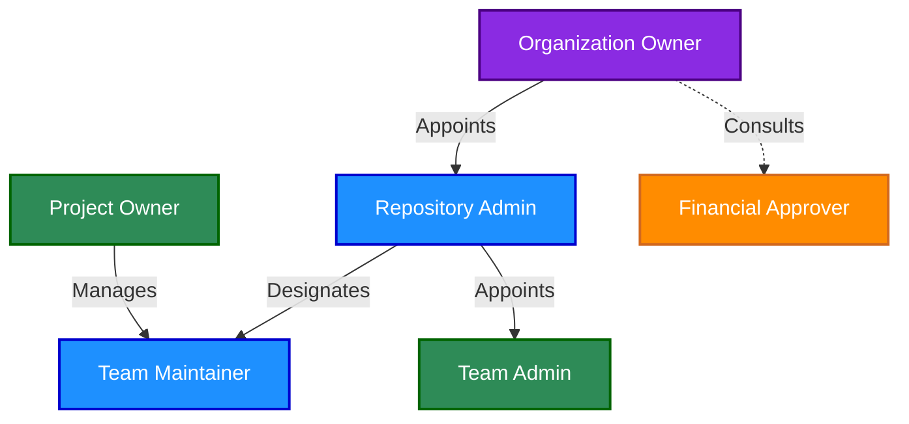
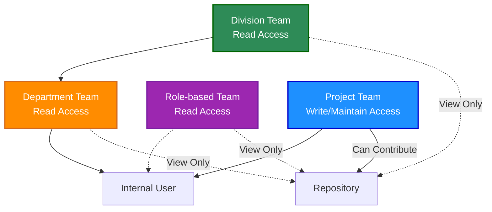
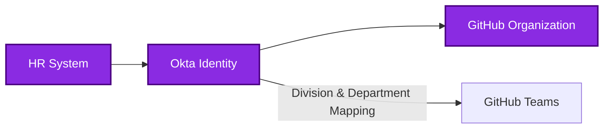
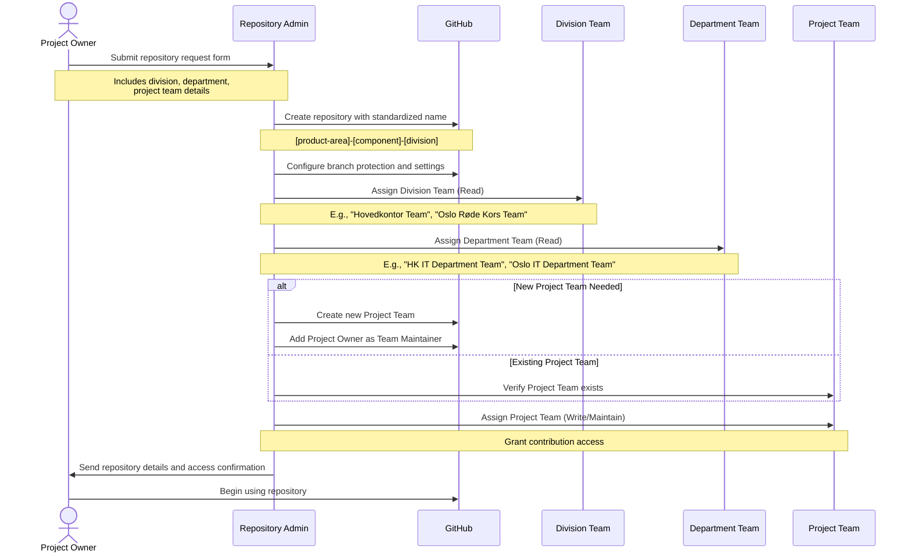

\newpage

# Introduction to GitHub Governance

## Purpose of this Manual

This manual serves as the official governance documentation for the Norwegian Red Cross GitHub organization. It establishes a comprehensive framework that defines how GitHub is managed, secured, and used within our organization.

The goal of this governance framework is to:

- Provide clear roles and responsibilities for GitHub management
- Establish consistent naming and organization standards
- Define secure workflows and approval processes
- Enable effective collaboration across teams and with external partners
- Ensure proper documentation of all repositories

## Governance Framework Overview

The Norwegian Red Cross GitHub governance framework consists of several interconnected components:

1. **Organizational Structure and Roles**: Clearly defined roles with specific responsibilities and permission levels
2. **Team Structure**: Hierarchical team organization reflecting our organizational structure
3. **User Management**: Automated provisioning and lifecycle management
4. **Repository Management**: Standardized naming, access control, and creation processes
5. **Request Workflows**: ServiceNow integration for repository and access requests
6. **Security Standards**: Branch protection, secret scanning, and security controls
7. **Documentation Standards**: Required documentation files and formatting guidelines

Each component works together to create a secure, consistent, and collaborative GitHub environment.

## How to Use This Manual

This manual is designed to serve different audiences within the Norwegian Red Cross. Depending on your role, certain sections will be more relevant to you.

### For GitHub Administrators

Focus on:
- Chapter 2: Organizational Structure and Roles
- Chapter 5: Repository Management
- Chapter 6: Request and Approval Workflows
- Chapter 8: Security Standards and Controls

### For Project Owners

Focus on:
- Chapter 2: Organizational Structure and Roles (specifically 2.1.2)
- Chapter 5: Repository Management
- Chapter 7: Platform Selection and Repository Visibility
- Chapter 9: Documentation Standards

### For Team Maintainers

Focus on:
- Chapter 3: Team Structure and Organization
- Chapter 4: User Management
- Chapter 9: Documentation Standards

### For Developers

Focus on:
- Chapter 5: Repository Management (specifically 5.3)
- Chapter 8: Security Standards and Controls
- Chapter 9: Documentation Standards

## Key Concepts and Terminology

### Team Structure

The Norwegian Red Cross uses a hierarchical team structure in GitHub:

1. **Division Teams** (Level 1) - Provide read access across divisions
2. **Department Teams** (Level 2) - Provide read access to department members
3. **Role-based Teams** - Provide read access based on job functions
4. **Project Teams** - Provide write access for active contributors

### Governance Roles

The governance structure relies on clearly defined roles:

- **Organization Owner** - Highest level of permissions
- **Repository Admin** - Manage repository creation and settings
- **Team Admin** - Manage team structures
- **Project Owner** - Responsible for specific repositories
- **Team Maintainer** - Manage team memberships
- **Team Member** - Regular contributor to repositories
- **Outside Collaborator** - External contributor with limited access
- **Financial Approver** - Approves financial aspects of GitHub usage

### Request Workflows

All GitHub requests go through ServiceNow with standardized workflows:

1. Repository creation requests
2. GitHub access requests
3. Repository conversion requests

\newpage

# Organizational Structure and Roles

## Governance Roles and Responsibilities

This section defines all roles involved in the governance of GitHub within Norwegian Red Cross, spanning across repository management, team administration, and the request/approval process.

### Organization-Level Roles

#### Organization Owner

- **Definition**: Individual with highest level of permissions, responsible for the overall GitHub organization.
- **Responsibilities**:
  - Managing billing and enterprise settings
  - Adding/removing Repository Admins
  - Configuring organizational security settings
  - Setting up organizational policies
- **Number of Users**: Limited group (2-3 people)
- **GitHub Permission Level**: Owner at organization level

#### Repository Admin

- **Definition**: Trusted individual responsible for repository governance across the organization.
- **Responsibilities**:
  - Creating new repositories following organizational naming conventions
  - Setting up branch protection rules and security settings
  - Configuring initial permissions and access controls
  - Establishing CI/CD workflows and quality gates
  - Ensuring all repositories have required documentation
  - Managing repository lifecycle (archiving, deletion)
- **Number of Users**: 5-7 trusted members with strong Git/GitHub knowledge
- **GitHub Permission Level**: Admin on repositories

#### Team Admin

- **Definition**: Individual responsible for managing GitHub team structures and memberships.
- **Responsibilities**:
  - Creating and configuring teams
  - Adding users to appropriate teams based on requests
  - Ensuring correct team hierarchies
  - Provisioning GitHub access for new users
  - Managing Outside Collaborator relationships
- **Number of Users**: Small group (3-5 people)
- **GitHub Permission Level**: Admin for team management

### Repository and Team-Level Roles

#### Project Owner

- **Definition**: Person who owns and is responsible for a repository or project.
- **Responsibilities**:
  - Approving repository creation requests
  - Defining repository purpose and access requirements
  - Validating team composition for repositories
  - Ensuring repository follows organizational standards
  - Approving repository access requests
- **Number of Users**: Multiple (one per project)
- **GitHub Permission Level**: Usually Maintain on their repositories

#### Team Maintainer

- **Definition**: Person who can manage a team's membership and settings.
- **Responsibilities**:
  - Adding/removing team members
  - Creating team discussions
  - Managing day-to-day team activities
  - Updating team descriptions and visibility
- **Number of Users**: Multiple (one or more per team)
- **GitHub Permission Level**: Team Maintainer + Write or Maintain on specific repositories

#### Team Member

- **Definition**: Regular contributor to a repository or project.
- **Responsibilities**:
  - Contributing code to repositories
  - Participating in team discussions
  - Reviewing pull requests
  - Following contribution guidelines
- **Number of Users**: Many
- **GitHub Permission Level**: Usually Write permission

### External Contributor Roles

#### Outside Collaborator

- **Definition**: External contributor (non-redcross.no) with repository-specific access.
- **Characteristics**:
  - Uses personal GitHub account
  - Does not authenticate through SSO
  - Not a member of the GitHub organization
- **Responsibilities**:
  - Contributing to specific repositories only
  - Following contribution guidelines
  - Participating in project discussions
- **Number of Users**: Varies by project
- **GitHub Permission Level**: Repository-specific (usually Write)

### Approval and Governance Roles

#### Financial Approver (Cost Center Manager)

- **Definition**: Manager responsible for approving the financial aspects of GitHub licenses.
- **Responsibilities**:
  - Approving costs for GitHub Enterprise licenses ($15 per user for SSO)
  - Budget management for GitHub expenses
  - Authorizing user access from a cost perspective
- **Number of Users**: Multiple (one per department/division)
- **GitHub Permission Level**: N/A (ServiceNow role)

## Role Relationships and Assignment Matrix

### Role Relationship Diagram

The following diagram illustrates the relationship between key roles in our GitHub governance structure:



**Role Relationship Explanation:**

- **Organization Owners appoint Repository Admins** - They select trusted individuals to manage repositories across the organization
- **Repository Admins designate Team Maintainers** - They assign people who can manage team membership for specific repositories
- **Repository Admins appoint Team Admins** - They select individuals responsible for overall team structure management
- **Project Owners manage Team Maintainers** - They oversee the team maintainers for their specific projects
- **Organization Owners consult with Financial Approvers** - They work together on licensing costs and budget approvals

### Role Assignment Matrix

The following matrix shows which roles can assign other roles:

| Role | Can Assign |
|------|------------|
| Organization Owner | Repository Admin, Team Admin, Financial Approver |
| Repository Admin | Project Owner, Team Maintainer |
| Team Admin | Team Member, Outside Collaborator |
| Project Owner | Team Maintainer (for their projects) |
| Team Maintainer | Team Member (for their teams) |

## Permission Levels

GitHub defines the following permission levels:

| GitHub Role | Description | Typical Use |
|-------------|-------------|-------------|
| Read | Can read and clone the repository | For team members who only need to view code |
| Triage | Read + can manage issues and PRs | For team members who help manage projects but don't write code |
| Write | Triage + can push to non-protected branches | For developers actively working on the code |
| Maintain | Write + can manage repository settings (except dangerous ones) | For project managers and tech leads |
| Admin | Full control including deletion and team access | For Repository Admins |

\newpage

# Team Structure and Organization

## Team Types

Norwegian Red Cross uses four types of teams in our GitHub organization, each with specific purposes and access patterns.

### Division Team

- **Definition**: Level 1 team providing Read access to division members.
- **Purpose**:
  - Provides organization-wide visibility to division members
  - Enables access to relevant repositories across the division
- **Naming Convention**: "[Division Name] Team" (e.g., "Hovedkontor Team")
- **Membership**:
  - All members of a division are automatically added
  - Maintained automatically via HR system integration
- **GitHub Permission Level**: Read access to division-specific repositories

### Department Team

- **Definition**: Level 2 team providing Read access to department members.
- **Purpose**:
  - Provides targeted visibility to department members
  - Ensures department-specific repositories can be seen by all department members
- **Naming Convention**: "[Division Abbreviation] [Department Name] Team" (e.g., "HK IT Department Team")
- **Membership**:
  - All members of a department are automatically added
  - Nested under their respective division teams
  - Maintained automatically via HR system integration
- **GitHub Permission Level**: Read access to department-specific repositories

### Role-based Team

- **Definition**: Cross-organizational team based on job roles or functions.
- **Purpose**:
  - Groups users with similar job functions across divisions
  - Provides access to specialized repositories relevant to specific roles
  - Facilitates functional collaboration across organizational boundaries
- **Naming Convention**: "[Role Name] Team" (e.g., "Developers Team", "UX Designers Team")
- **Membership**:
  - Users with the same job function across divisions/departments
  - Can be automatically assigned based on HR role attributes
  - May be supplemented with manual assignments
- **GitHub Permission Level**: Typically Read access to function-specific repositories

### Project Team

- **Definition**: Cross-organizational team providing Write/Maintain access to repository contributors.
- **Purpose**:
  - Enables active contribution to specific repositories
  - Allows members from any division or department to collaborate
- **Naming Convention**: "[Division]-[Product Area]-Team" (e.g., "HK-Donor-Management-Team")
- **Membership**:
  - Managed by Project Owners and Team Maintainers
  - Can include members from any division or department
  - Can include Outside Collaborators
- **GitHub Permission Level**: Write or Maintain access to specific repositories

## Team Access Model

The following diagram illustrates the practical relationship between roles, teams, and repository access:



**Access Model:**
- Division and Department Teams provide Read-only access to repositories
- Role-based Teams provide Read access to role-specific repositories
- Project Teams provide Write or Maintain access to specific repositories
- Team members can be Internal Users or Outside Collaborators
- Repository Admins have Admin access to repositories
- Project Owners typically have Maintain access to their repositories

## Team Naming Conventions

To maintain consistency with our team structure, teams are named according to these patterns:

1. **Division Teams** (Level 1):
   - Format: "[Division Name] Team"
   - Examples: "Hovedkontor Team", "Oslo Røde Kors Team"

2. **Department Teams** (Level 2):
   - Format: "[Division Abbreviation] [Department Name] Team"
   - Examples: "HK IT Department Team", "Oslo IT Department Team"

3. **Role-based Teams**:
   - Format: "[Role Name] Team"
   - Examples: "Developers Team", "Project Managers Team"

4. **Project Teams**:
   - Format: "[Division]-[Product Area]-Team"
   - Examples: "HK-Donor-Management-Team", "Oslo-Volunteer-Portal-Team"

\newpage

# User Management

## User Types

Norwegian Red Cross manages two distinct user types in GitHub with different access patterns, authentication methods, and membership characteristics.

### Internal Users

- **Definition**: Employee or consultant with a redcross.no account.
- **Characteristics**:
  - Has redcross.no email
  - Authenticates through SSO with Okta
  - Automatically assigned to organizational structure teams
  - Full member of the GitHub organization
- **GitHub Permission Level**: Varies based on team membership
- **Authentication Flow**: Single Sign-On through Okta
- **Provisioning**: Automated via HR system and Okta

### Outside Collaborators

- **Definition**: External contributor (non-redcross.no) with repository-specific access.
- **Characteristics**:
  - Uses personal GitHub account
  - Does not authenticate through SSO
  - Not a member of the GitHub organization
  - Has access only to specific repositories
- **GitHub Permission Level**: Repository-specific (usually Write)
- **Authentication Flow**: Standard GitHub authentication
- **Provisioning**: Manual by Repository Admin or Team Admin

## User Provisioning

User provisioning for our GitHub organization follows an automated flow that ensures proper access management throughout the employee lifecycle.



### HR System Integration

Our HR system serves as the primary source of truth for all user data:

1. **User Identity Information**:
   - Basic user details (name, email)
   - Employment status (active, on leave, terminated)
   - Start and end dates

2. **Organizational Metadata**:
   - Division assignment (Level 1)
   - Department assignment (Level 2)
   - Job title and role
   - Reporting structure

3. **User Lifecycle Events**:
   - Hiring (creates new user accounts)
   - Transfers (updates organizational data)
   - Departures (triggers account deactivation)

### Okta Integration

Okta serves as our identity provider and handles synchronization between HR and GitHub:

1. **HR to Okta Synchronization**:
   - User profile creation based on HR data
   - Attribute mapping from HR to Okta profile
   - Group assignments based on organizational structure

2. **Authentication Management**:
   - SSO credentials for redcross.no accounts
   - Multi-factor authentication policies
   - Password policies and management

3. **Access Management**:
   - Application assignment (who gets GitHub access)
   - Group-based access controls
   - Role-based permissions

### GitHub SCIM Provisioning

User accounts and team memberships in GitHub are managed through SCIM (System for Cross-domain Identity Management):

1. **User Account Provisioning**:
   - Automatic creation of GitHub accounts
   - Profile updates when HR data changes
   - Account deactivation upon termination

2. **Team Membership Automation**:
   - Mapping from Okta groups to GitHub teams
   - Automated team assignments based on HR attributes
   - Team hierarchy alignment with organizational structure

### Attribute Mapping Strategy

User attributes flow from HR to GitHub via Okta following this mapping pattern:

| HR System Attribute | Okta Attribute | GitHub Information |
|---------------------|----------------|-------------------|
| Employee Number | employeeNumber | N/A (internal reference) |
| Full Name | displayName | Display Name |
| Email | email | Primary Email |
| Division | division | Division Team Membership (Level 1) |
| Department | department | Department Team Membership (Level 2) |
| Job Title | title | Profile Information |
| Job Role | role | Role-based Team Membership |
| Manager | manager | N/A (for future use) |

## User Lifecycle Management

The provisioning system handles the complete employee lifecycle:

### Onboarding

- HR creates user record → automatically provisioned to Okta → automatically provisioned to GitHub
- User receives initial access based on division and department
- Teams are automatically assigned based on organizational data

### Role Changes and Transfers

- HR updates user record → changes sync to Okta → changes reflect in GitHub
- Team memberships automatically update based on new division/department
- Access levels adjust according to new responsibilities

### Offboarding

- HR updates status to terminated → Okta deactivates account → GitHub access revoked
- Automatic removal from teams
- Contributions remain attributed to the user account

### Outside Collaborator Management

Outside Collaborators (pro-bono contributors, volunteers, partners) follow a different process:

1. **Manual Invitation**:
   - Not provisioned through HR/Okta flow
   - Added as Outside Collaborators to specific repositories
   - Managed by Repository Admins or Project Owners

2. **Authentication**:
   - Use personal GitHub accounts
   - Not subject to SSO requirements
   - Authenticate directly with GitHub

\newpage

# Repository Management

## Repository Governance Structure

GitHub's permission model allows us to create a governance structure to maintain consistency, security, and proper governance across all repositories.

### Organization Owners and Repository Admins

Organization Owners have the highest level of permissions, while a dedicated team of Repository Admins will handle day-to-day repository governance:

**Organization Owner**
- Limited group (2-3 people) with full administrative access to the organization
- Can change organization settings, billing, and security policies
- Ultimate oversight of all repositories and teams

**Repository Admin**
- A team with Admin permission level across repositories
- Members from different divisions of the organization
- Responsible for repository creation and governance
- 5-7 trusted members with strong Git/GitHub knowledge

## Repository Access Control

With our 2-level organizational structure, Repository Admins will implement the following access model:

### Access Assignment Strategy

1. **Division Team Access (Level 1)**
   - Provides organization-wide visibility to division members
   - All members of a division get Read access to relevant repositories
   - Examples: "Hovedkontor Team", "Oslo Røde Kors Team", "Hordaland Røde Kors Team"

2. **Department Team Access (Level 2)**
   - Provides more targeted visibility to department members
   - All members of a department get Read access to department-specific repositories
   - Examples: "HK IT Department Team", "Oslo IT Department Team" within each division

3. **Role-based Team Access**
   - Provides read access to repositories based on job function
   - Members with similar roles get access to relevant resources
   - Examples: "Developers Team", "UX Designers Team"

4. **Project Team Access (Cross-Organizational)**
   - Provides contribution access (Write/Maintain) to actual contributors
   - Members can come from any division or department
   - Created specifically for repository contribution needs

### Cross-Divisional Collaboration

The 2-level structure with Project and Role-based Teams allows for efficient cross-divisional collaboration:

1. **Members from different divisions** can be added to the same Project Team
2. **IT departments from different divisions** can collaborate on shared repositories
3. **Outside Collaborators** can be added to Project Teams (not Division/Department teams)
4. **Users with the same job function** can view repositories relevant to their roles via Role-based Teams

## Repository Naming Conventions

### Naming Structure

All repositories should follow this naming pattern:

```
[product-area]-[component]-[division]
```

Where:
- **product-area**: The functional product or service area
- **component**: The specific component or module
- **division**: The organizational division (optional for organization-wide repositories)

This naming convention aligns with our team naming conventions and repository access model.

### Common Component Names

Use these standard component names when applicable to ensure consistent naming across projects:

| Component Name | Description |
|----------------|-------------|
| `api` | API implementation |
| `client` | Client library for accessing a service |
| `service` | Backend service |
| `frontend` | User interface implementation |
| `admin` | Administration interface |
| `docs` | Documentation |
| `core` | Core shared library |
| `utils` | Utility functions |
| `config` | Configuration files/templates |
| `infra` | Infrastructure as code |
| `cli` | Command-line interface tool |
| `sdk` | Software Development Kit |
| `mobile` | Mobile application |
| `worker` | Background worker service |
| `analytics` | Analytics component |
| `cms` | Content Management System |
| `gateway` | API Gateway or service gateway |
| `db` | Database schema, migrations, or tools |
| `monitoring` | Monitoring and alerting components |
| `auth` | Authentication/authorization components |

### Examples by Category

**Shared Services**
```
infrastructure-monitoring
design-system-components
api-platform-core
authentication-service
analytics-dashboard
```

**Division-Specific Products**
```
volunteer-portal-oslo
website-frontend-hordaland
event-management-oslo
donor-management-hk
training-platform-hordaland
```

**National Products**
```
crm-donor-management
finance-reporting
national-website-frontend
emergency-response-system
membership-management
```

**Special Repository Types**
```
template-nodejs-api
poc-blockchain-donations
archive-legacy-website
```

## Repository Creation Process

The following diagram outlines the repository creation and team assignment flow:



For project teams that need Write/Maintain access, Repository Admins will:

1. Create project-specific team named after repository (e.g., "[Division]-[Product Area]-Team")
2. Add Project Owner as team maintainer to grant team management rights
3. Grant team appropriate permissions (usually Write or Maintain)
4. Transfer team management responsibility to Project Owner
5. Project Owner can then add/remove members as needed

## Repository Conversion

Existing repositories may be migrated between platforms or converted from private to public when necessary. This requires:

1. **Migration Assessment**
   - Repository content review against documentation standards
   - Dependency analysis
   - Access control evaluation using team-based model
   - History preservation planning

2. **Approval Process**
   - Follow the Repository Conversion Request Flow through ServiceNow
   - Requires approvals from Project Owner, Organization Owner, and potentially Financial Approver
   - Additional security review by Repository Admins for platform migrations
   - Communications plan for public conversions

3. **Technical Migration**
   - Repository transfer process
   - Secrets scanning and removal
   - CI/CD pipeline reconfiguration
   - Access control setup according to the repository governance model
   - Outside Collaborator integration updates

\newpage

# Request and Approval Workflows

## ServiceNow Integration Overview

Norwegian Red Cross uses ServiceNow as the self-service portal for GitHub-related requests in our "Norwegian Red Cross" GitHub organization. This document outlines the primary ordering flows:

1. **GitHub Repository Request Flow**: How users request new GitHub repositories
2. **GitHub Access Request Flow**: How users request access to GitHub
3. **Repository Conversion Request Flow**: How users request repository conversions (e.g., private to public, platform migrations)

These ServiceNow-based flows ensure proper governance, standardization, and tracking of all GitHub-related requests.

### Request Flow Explanation

1. **User Submits Request**: All GitHub requests start with a user accessing the ServiceNow portal
2. **Request Type Selection**:
   - Repository Request: For creating new repositories in the Norwegian Red Cross GitHub organization
   - Access Request: For requesting access to GitHub for users
   - Conversion Request: For converting repositories (e.g., private to public, platform migrations)
3. **Administrative Routing**:
   - Repository requests are routed to Repository Admins after approvals
   - Access requests are routed to Team Admins after approvals
   - Conversion requests are routed to Repository Admins after approvals from Project Owner, Organization Owner, and possibly Financial Approver
4. **GitHub Configuration**:
   - Repository Admins create and configure repositories in the Norwegian Red Cross GitHub organization
   - Team Admins provision user access to GitHub
   - Repository Admins perform repository conversions following platform selection guidelines

## Repository Request Workflow

The repository request flow begins in ServiceNow and feeds into the existing "Repository Creation and Team Assignment Flow" within the Norwegian Red Cross GitHub organization.

### Repository Request Form Fields

The ServiceNow Repository Request form includes the following fields:

| Field | Description | Example |
|-------|-------------|---------|
| Division | Organizational division (dropdown from HR system) | Oslo Røde Kors |
| Department | Organizational department (dropdown from HR system) | IT Department |
| Repository Name | Following [product-area]-[component]-[division] format | volunteer-portal-api-oslo |
| Purpose | Brief description of repository purpose | API for volunteer management application |
| Project Team | New Project Team name or existing team (dropdown of existing teams + option to create new) | Oslo-Volunteer-Portal-Team |
| Internal Project Team Members | Internal Users selected from employee directory | [Selected employees from dropdown] |
| External Project Team Members | Outside Collaborators (email addresses) | volunteer@example.com, partner@example.org |
| Special Requirements | Any special configuration needs | Requires specific CI/CD setup |
| Requested For | Project Owner who will own the repository | [Selected from employee directory] |

### Repository Request Approval Workflow

The repository request approval process involves multiple stakeholders with different concerns:

1. **Financial Approver (Cost Center Manager)**:
   - Responsible for the financial aspect of GitHub licenses
   - Approves the cost implications ($15 per user for SSO access)
   - Usually the department or division manager responsible for the budget

2. **Project Owner**:
   - Responsible for the technical and access governance aspects
   - Validates the repository purpose and team composition
   - Verifies that the repository name follows conventions
   - Person who will own and be responsible for the repository

Only after both approvals are received does the request move to the Repository Admin queue for implementation.

## Access Request Workflow

The access request flow manages how users request access to GitHub.

### Access Request Form Fields

The ServiceNow GitHub Access Request form includes the following fields:

| Field | Description | Example |
|-------|-------------|---------|
| User | Person requiring GitHub access (selected from employee directory) | [Selected employee from dropdown] |
| User Type | Internal User or Outside Collaborator (dropdown) | Internal |
| Division | User's division (auto-populated from HR system) | Oslo Røde Kors |
| Department | User's department (auto-populated from HR system) | IT Department |
| Justification | Business reason for GitHub access | Working on development projects |
| Duration | Temporary or permanent access (dropdown) | Permanent |
| Requested For | Person who will receive access (auto-populated from User field) | [Same as User field] |
| Manager | User's manager (automatically populated from HR system) | [Auto-populated from HR data] |

For external users, additional fields appear:
| Field | Description | Example |
|-------|-------------|---------|
| External Email | Email address for external user | volunteer@example.com |
| Organization | Organization the external user belongs to | Partner Organization Name |
| Project | Project the external user will work on | Volunteer Portal |

### Access Request Approval Workflow

The GitHub access request approval process involves multiple stakeholders with different concerns:

1. **Financial Approver (Cost Center Manager)**:
   - Responsible for the financial aspect of GitHub licenses
   - Approves the cost implications ($15 per user for SSO access)
   - Usually the department or division manager responsible for the budget

2. **Project Owner**:
   - Responsible for evaluating if the user needs GitHub access
   - Validates the justification for access
   - Ensures access is appropriate for the user's role
   - Person who will be responsible for the user's activities in GitHub

Only after both approvals are received does the request move to the Team Admin queue for implementation.

## Repository Conversion Request Flow

The repository conversion request flow manages how users request conversion of repositories (e.g., from private to public or between platforms).

### Repository Conversion Form Fields

The ServiceNow GitHub Repository Conversion form includes the following fields:

| Field | Description | Example |
|-------|-------------|---------|
| Repository Name | Existing repository name | volunteer-portal-api-oslo |
| Repository URL | Link to the existing repository | https://github.com/norwegianredcross/volunteer-portal-api-oslo |
| Conversion Type | Type of conversion (dropdown) | Private to Public, Azure DevOps to GitHub, etc. |
| Target Platform | Target platform if migrating (dropdown) | GitHub, Azure DevOps |
| Justification | Business reason for conversion | Increasing community involvement |
| Compliance Check | Confirmation of compliance with public repository guidelines | [Checkbox] |
| Requested For | Project Owner who owns the repository | [Selected from employee directory] |

### Repository Conversion Approval Process

The repository conversion approval process follows the same pattern as new repository creation with additional security reviews:

1. **Project Owner**:
   - Validates the need for repository conversion
   - Confirms ownership and responsibility for the repository
   - Ensures compliance with public repository guidelines (if applicable)

2. **Organization Owner**:
   - Evaluates alignment with organizational strategy
   - Ensures proper consideration of visibility implications
   - Approves any changes to organizational structure

3. **Financial Approver** (for public conversions):
   - Evaluates long-term maintenance implications
   - Approves resource allocation for continued support
   - Reviews licensing implications

Only after all approvals are received does the request move to the Repository Admin queue for implementation.

\newpage

# Platform Selection and Repository Visibility

## GitHub vs Azure DevOps

Norwegian Red Cross maintains both Azure DevOps and GitHub as development platforms. The following comparison helps determine which platform to use for different project types:

| Feature | Azure DevOps | GitHub |
|---------|-------------|--------|
| **Primary Use Cases** | Enterprise projects, integrated Microsoft services | Open source, community collaboration, modern development workflows |
| **Access Management** | AD/AAD integration, fine-grained | SSO via Okta, team-based |
| **CI/CD** | Azure Pipelines, tight Azure integration | GitHub Actions, flexible integrations |
| **Project Management** | Comprehensive (Boards, Backlogs, Sprints) | Basic (Issues, Projects, Milestones) |
| **Artifact Management** | Built-in artifact repositories | GitHub Packages |
| **Cost Model** | Per-user licensing with enterprise features | Per-user for private repos, free for public repos |
| **External Sharing** | Complex, requires AAD guest accounts | Simple, supports outside collaborators |

## Decision Framework

### Use Azure DevOps for projects that:

1. **Require tight Microsoft ecosystem integration**
   - Integrate extensively with other Microsoft services (Azure, Microsoft 365)
   - Use Azure-specific services and deployment targets
   - Leverage Azure identity and access management

2. **Need comprehensive project management**
   - Require detailed work item tracking and custom workflows
   - Use advanced project planning with epics, features, user stories
   - Need detailed reporting and dashboards
   - Utilize velocity tracking and sprint planning

3. **Have strict enterprise compliance requirements**
   - Require specific audit trail capabilities
   - Need detailed access control at the feature level
   - Must comply with specific security frameworks that Azure DevOps supports

4. **Involve legacy systems and integration**
   - Projects migrated from TFS/older DevOps systems
   - Systems requiring extensive TFVC (centralized version control)
   - Integration with older Microsoft technology stacks

### Use GitHub for projects that:

1. **Benefit from community involvement**
   - Open source initiatives
   - Projects seeking external contributors
   - Volunteer-driven development
   - Initiatives that benefit from public visibility

2. **Use modern development workflows**
   - Projects using container-based development
   - Infrastructure as Code (IaC) repositories
   - Projects benefiting from GitHub's developer ecosystem
   - Code that leverages GitHub's social coding features

3. **Need simple external collaboration**
   - Projects involving external partners
   - Collaborative initiatives with other organizations
   - Projects that need simplified onboarding for Outside Collaborators
   - Projects benefiting from the team-based access model

4. **Align with developer preferences**
   - Projects where developer familiarity and preference for GitHub is important
   - Teams that prefer GitHub's developer experience
   - Projects needing to attract developer talent familiar with GitHub

## Public Repository Guidelines for GitHub

Repositories should be made public when they meet the following criteria:

### Mandatory Requirements

1. **No Sensitive Information**
   - Contains no credentials, tokens, or secrets
   - Excludes internal infrastructure details
   - Contains no personally identifiable information (PII)
   - Excludes proprietary business logic, algorithms, or confidential roadmaps

2. **Legal Compliance**
   - Has appropriate open source license
   - All dependencies comply with license requirements
   - No intellectual property concerns
   - Complies with export control regulations

3. **Quality Standards**
   - Follows coding standards and best practices
   - Has complete and accurate documentation standards
   - Includes contribution guidelines
   - Has passed security review by Repository Admins

### Recommended Characteristics

1. **Community Benefit**
   - Provides value to the wider community
   - Solves common problems
   - Demonstrates innovative approaches
   - Serves humanitarian or non-profit purposes

2. **Sustainability**
   - Has resources allocated for maintenance
   - Assigned Team Maintainers to review contributions
   - Commitment to addressing issues and vulnerabilities by Project Owner
   - Long-term support plan approved by Organization Owner

3. **Strategic Alignment**
   - Aligns with Red Cross digital strategy
   - Enhances organizational reputation
   - Demonstrates technical leadership
   - Supports partner collaboration goals

## Platform Selection Workflow

The decision process for selecting between GitHub and Azure DevOps follows this workflow:

```
Project Initiation
     ↓
Is this tightly integrated with Microsoft ecosystem? 
     ↓ Yes     ↓ No
Comprehensive   Community
PM needs?       Involvement?
     ↓ Yes     ↓ Yes
Azure DevOps    GitHub
     ↓ No      ↓ No
     →   External Collaboration?
          ↓ Yes     ↓ No
          GitHub   Enterprise Compliance?
                    ↓ Yes     ↓ No
                    Azure     Developer
                    DevOps    Preference?
                              ↓
                         Platform Decision
```

## Public Repository Approval Process

The decision to make a repository public follows this process:

1. Project Owner submits public repository request via ServiceNow
2. Repository Admin requests organizational approval from Organization Owner
3. Financial Approver evaluates licensing and maintenance implications
4. Repository Admin conducts security assessment
5. If all approvals received, repository can be made public

\newpage

# Security Standards and Controls

## Branch Protection Requirements

All repositories must implement the following branch protection rules for the `main` branch:

### Required Protection Rules
- **Require pull request reviews before merging** (mandatory)
  - At least 1 approval required (2 for critical repositories)
  - Dismiss stale pull request approvals when new commits are pushed
  - Require review from Code Owners (defined in CODEOWNERS template)

- **Restrict who can push to matching branches**
  - Only allow Repository Admins to push directly to protected branches

### Status Checks (optional)
- If CI/CD is implemented, require status checks to pass before merging
  - Require branches to be up to date before merging
  - Common status checks include:
    - Linting
    - Unit tests
    - Build verification

## Secret Scanning (mandatory for all repositories)

All repositories must have GitHub Advanced Security enabled with secret scanning:

- **Secret scanning features to enable:**
  - Push protection - prevents secrets from being pushed
  - Automated alerts - GitHub has built-in functionality to alert Repository Admins when secrets are detected

GitHub's secret scanning supports detecting various types of secrets automatically, including:
- API keys
- Authentication tokens
- Certificates
- Database connection strings
- Service credentials

### Handling Detected Secrets
1. Immediately revoke the exposed secret
2. Remove the secret from the repository history
3. Document the incident in ServiceNow
4. Rotate all potentially affected credentials

### Security Roles and Responsibilities

Security management is a shared responsibility across different roles:

1. **Repository Admins**:
   - Configure and enforce security settings
   - Respond to critical security alerts
   - Implement repository-level security controls
   - Provide security guidance to teams

2. **Project Owners**:
   - Ensure repositories comply with security standards
   - Approve security-related changes
   - Responsible for the overall security posture of their repositories
   - Prioritize security fixes in their development roadmap

3. **Team Maintainers**:
   - Monitor security alerts for their team's repositories
   - Ensure team members follow secure development practices
   - Coordinate responses to non-critical security issues
   - Review security implications of code changes

## Dependency Management (optional)

Repositories should implement the following dependency management practices:

- **Dependabot alerts** - automatically detect vulnerabilities
- **Dependabot security updates** - automatically create PRs to fix vulnerabilities
- **Dependency review** - review dependency changes in PRs

## Repository Security Checklist

Every new repository must complete this security checklist:

| Security Item | Required | Configured | Notes |
|---------------|----------|------------|-------|
| Branch protection rules | ✅ | | Configured by Repository Admin |
| CODEOWNERS file | ✅ | | Managed by Project Owner |
| Secret scanning | ✅ | | Enabled by Repository Admin |
| SECURITY.md | Recommended | | Use SECURITY.md template |
| Dependabot alerts | Recommended | | |
| Dependabot security updates | Recommended | | |
| Required status checks | If CI/CD implemented | | |

## SECURITY.md Template

Each repository should include a SECURITY.md file that describes the security policy and vulnerability reporting process.

We have created a standard SECURITY.md template that can be used as a starting point. The template includes:

- Supported versions information
- Vulnerability reporting procedures
- Security measures implemented in the repository
- Disclosure policy and timelines

This template should be customized for each repository, particularly the "Supported Versions" section, to reflect the specific project's security practices.

\newpage

# Documentation Standards

## Required Documentation Files

Every repository in the Norwegian Red Cross GitHub organization must contain the following documentation files:

### README.md

All repositories must have a README.md file in the root directory that includes:

- **Project Name and Description**
  - Clear description of the repository's purpose
  - Business context and relationship to other systems
  - Status indicator (active, maintenance, deprecated)

- **Getting Started Guide**
  - Prerequisites and dependencies
  - Installation instructions
  - Basic usage examples
  - Environment setup details

- **Architecture Overview**
  - High-level architecture diagram (if applicable)
  - Key components and interactions
  - External system dependencies

- **Contributing Information**
  - Link to CONTRIBUTING.md
  - Quick reference for development workflow

- **License Information**
  - Clear statement of licensing terms
  - Copyright notice

- **Contact Information**
  - Team/Department responsible
  - How to report issues or request features

Use the README.md template to create your README.md file.

### CONTRIBUTING.md

All repositories must have a CONTRIBUTING.md file that includes:

- **Contribution Process**
  - How to report bugs
  - How to suggest enhancements
  - How to submit changes

- **Development Environment Setup**
  - Step-by-step setup instructions
  - Required tools and versions
  - Local testing procedures

- **Coding Standards**
  - Code style and formatting rules
  - Language-specific conventions
  - Documentation requirements for code

- **Testing Requirements**
  - Test coverage expectations
  - Types of tests required
  - How to run tests locally

- **Pull Request Process**
  - Branch naming conventions
  - Commit message standards
  - PR template usage instructions

- **Review Process**
  - What reviewers look for
  - Expected response times
  - How feedback should be addressed

Use the CONTRIBUTING.md template to create your CONTRIBUTING.md file.

### CODEOWNERS

All repositories must have a CODEOWNERS file that:

- Designates owners for specific directories or file types
- Includes at least one Repository Admin or Team Maintainer
- Maps to the actual project team structure

Use the CODEOWNERS template to create your CODEOWNERS file.

### LICENSE

All repositories must have an appropriate LICENSE file:

- Internal repositories: Proprietary license template
- Public repositories: Approved open source license (MIT recommended)

Use the LICENSE-opensource.md template for open source repositories.
Use the LICENSE-internal.md template for internal repositories.

## Documentation Roles and Responsibilities

The responsibility for maintaining documentation is shared across different roles:

1. **Repository Admins**:
   - Set up initial required documentation during repository creation
   - Verify documentation compliance with these standards
   - Enforce documentation requirements through branch protection rules
   - Conduct periodic audits of documentation quality

2. **Project Owners**:
   - Responsible for the overall quality and accuracy of documentation
   - Ensure documentation is kept up-to-date with project changes
   - Review and approve significant documentation updates
   - Ensure README.md accurately reflects the project's current status

3. **Team Maintainers**:
   - Manage CODEOWNERS file and ensure it reflects team structure
   - Review documentation contributions from team members
   - Ensure code changes include appropriate documentation updates
   - Help onboard new contributors to documentation practices

4. **Team Members**:
   - Update documentation when making code changes
   - Follow the established documentation standards
   - Report outdated or incorrect documentation
   - Contribute to documentation improvements

## Documentation Maintenance

- README.md should be updated with any significant changes by Project Owners
- CODEOWNERS should be reviewed quarterly by Project Owners and Team Maintainers
- All documentation should be reviewed annually by the responsible Project Owner
- Outdated documentation should be updated or clearly marked as deprecated
- Repository Admins should verify documentation compliance during periodic repository audits

## Documentation Standards Resources

We have created dedicated example files to demonstrate the recommended documentation standards:

- **Markdown Standards and Examples** - Comprehensive guide to Markdown formatting
- **Mermaid Diagram Examples** - Examples of well-formatted diagrams

Refer to these examples when creating documentation for your repositories.

\newpage

# Best Practices and Compliance

## Governance Structure Best Practices

### Role-Based Access Control

**Industry Best Practice**: Implement principle of least privilege with clearly defined roles and responsibilities.

**Our Implementation**:
- ✅ Comprehensive role definitions with specific responsibilities and permission levels
- ✅ Hierarchical permission structure from Organization Owners to Team Members
- ✅ Separation between administrative roles (Repository Admin, Team Admin) and contributor roles (Project Owner, Team Maintainer)
- ✅ Financial approvals separated from technical approvals for proper governance

**Alignment**: Exceeds industry standards by defining additional specialized roles (Team Admin, Financial Approver) beyond GitHub's built-in roles.

### Team Organization

**Industry Best Practice**: Structure teams to reflect organizational hierarchy while enabling cross-team collaboration.

**Our Implementation**:
- ✅ Team hierarchy reflects organizational structure (Division, Department)
- ✅ Role-based Teams enable cross-organizational functional collaboration
- ✅ Project Teams facilitate collaboration across division boundaries
- ✅ Standardized team naming conventions for consistency

**Alignment**: Exceeds industry standards with multi-level team structure and role-based teams that balance organizational hierarchy with collaborative needs.

## Security Best Practices

### Repository Protection

**Industry Best Practice**: Implement branch protection, code reviews, and security scanning for all repositories.

**Our Implementation**:
- ✅ Mandatory branch protection rules for all repositories
- ✅ Required pull request reviews with code owner approval
- ✅ Restricted direct pushes to protected branches
- ✅ Secret scanning with push protection enabled
- ✅ Recommended dependency management with Dependabot

**Alignment**: Strong alignment with GitHub's recommended security practices with comprehensive protection mechanisms.

### Access Control Security

**Industry Best Practice**: Use SSO, enforce MFA, and automate user provisioning/deprovisioning.

**Our Implementation**:
- ✅ SSO integration through Okta for internal users
- ✅ Automated user provisioning via SCIM from HR systems
- ✅ Complete user lifecycle management including offboarding
- ✅ Controlled process for Outside Collaborators

**Alignment**: Strong alignment with enterprise security best practices for identity management.

## Development Workflow Best Practices

### Repository Standardization

**Industry Best Practice**: Standardize repository structure, naming, and required documentation.

**Our Implementation**:
- ✅ Consistent repository naming convention with clear patterns
- ✅ Required documentation files (README, CONTRIBUTING, CODEOWNERS)
- ✅ Standardized templates for common files
- ✅ Clear documentation standards with examples

**Alignment**: Strong alignment with documentation best practices, providing comprehensive templates and requirements.

### Contribution Workflows

**Industry Best Practice**: Define clear contribution processes with appropriate reviews and feedback.

**Our Implementation**:
- ✅ Defined pull request process with required reviews
- ✅ CODEOWNERS implementation for appropriate reviewer assignment
- ✅ Branch protection ensuring quality checks pass
- ✅ Clear documentation of contributor responsibilities

**Alignment**: Strong alignment with code review and contribution best practices.

## Integration and Automation Best Practices

### Process Automation

**Industry Best Practice**: Automate routine governance and approval processes.

**Our Implementation**:
- ✅ ServiceNow integration for all GitHub-related requests
- ✅ Standardized approval workflows for repository creation and access
- ✅ Automated team assignment based on HR system attributes
- ✅ Repository conversion workflows for platform migrations

**Alignment**: Strong alignment with enterprise IT service management practices, going beyond basic GitHub functionality.

### Platform Integration

**Industry Best Practice**: Integrate GitHub with other development and operational tools.

**Our Implementation**:
- ✅ Integration with HR systems for user provisioning
- ✅ ServiceNow integration for request management
- ✅ Clear platform selection guidelines for GitHub vs Azure DevOps
- ✅ Guidelines for CI/CD implementation through status checks

**Alignment**: Strong alignment with enterprise integration needs, particularly with HR and service management systems.

## Collaboration Best Practices

### Internal Collaboration

**Industry Best Practice**: Enable seamless collaboration across teams while maintaining proper access controls.

**Our Implementation**:
- ✅ Multi-level team structure with appropriate permissions
- ✅ Cross-divisional collaboration mechanisms through Project Teams
- ✅ Role-based Teams for functional collaboration
- ✅ Clear documentation of team purposes and membership criteria

**Alignment**: Strong alignment with collaboration best practices, with multiple team types to support different collaboration patterns.

### External Collaboration

**Industry Best Practice**: Enable secure collaboration with external partners while maintaining governance.

**Our Implementation**:
- ✅ Defined Outside Collaborator role with clear permissions
- ✅ Process for provisioning external users
- ✅ Guidelines for public repositories
- ✅ Security standards that apply to all collaborators

**Alignment**: Strong alignment with external collaboration best practices, with appropriate controls for public and private collaboration.

## Areas of Excellence and Potential Enhancements

### Areas of Excellence

1. **Comprehensive Role Definition**: The detailed role definitions with clear responsibilities exceed GitHub's standard roles, providing clear governance.

2. **Multi-level Team Structure**: The hierarchical team model with Division, Department, Role-based, and Project teams provides both organizational alignment and flexible collaboration.

3. **Integration with Enterprise Systems**: The integration with HR systems for provisioning and ServiceNow for requests creates a robust enterprise governance framework.

4. **Documentation Standards**: The extensive documentation requirements with templates and examples ensure consistency and quality across repositories.

5. **Security-First Approach**: Mandatory branch protection, secret scanning, and clear security incident processes demonstrate a strong security focus.

### Potential Enhancement Areas

1. **Compliance Monitoring**: Consider adding automated compliance checking to verify repositories adhere to governance standards.

2. **Metric Tracking**: Implement metrics and reporting for GitHub usage, contribution patterns, and security compliance.

3. **Developer Experience**: Balance governance requirements with developer experience to ensure productivity alongside security.

4. **Continuous Improvement Process**: Establish a formal process for regularly reviewing and updating the governance framework.

5. **Training Resources**: Develop training materials to help users understand and follow the governance framework.

\newpage

# Appendices

## Appendix A: Templates

The following standardized templates are available in the templates directory:

### README.md Template

A comprehensive template for repository README files, including sections for:
- Project description
- Installation instructions
- Usage examples
- Architecture overview
- Contributing guidelines
- License information
- Contact details

### CONTRIBUTING.md Template

A template for contribution guidelines, including:
- Code of conduct
- Development environment setup
- Branch naming conventions
- Commit message guidelines
- Pull request process
- Code review standards

### CODEOWNERS Template

A template for defining code ownership, with examples of:
- Directory-specific ownership
- File-type ownership
- Default owners

### LICENSE Templates

Two license templates are provided:
- LICENSE-opensource.md - For public repositories
- LICENSE-internal.md - For internal repositories

### SECURITY.md Template

A template for security policies, including:
- Supported versions
- Vulnerability reporting procedures
- Security measures
- Disclosure policy

### Issue and Pull Request Templates

Templates for:
- Bug report issues
- Feature request issues
- Pull request descriptions

## Appendix B: Quick Reference Guides

### GitHub Administrator Quick Reference

Key responsibilities:
- Repository creation and configuration
- Branch protection setup
- Team structure management
- Security policy enforcement

Key documents:
- 01-github-governance-roles.md
- 04-github-repository-governance.md
- 08-github-security-standards.md

### Project Owner Quick Reference

Key responsibilities:
- Repository purpose definition
- Team member management
- Documentation quality
- Repository approval

Key documents:
- 04-github-repository-governance.md
- 05-github-repository-naming.md
- 09-github-documentation-standards.md

### Team Maintainer Quick Reference

Key responsibilities:
- Team membership management
- Code review coordination
- CODEOWNERS maintenance

Key documents:
- 01-github-governance-roles.md
- 03-github-provisioning.md
- 09-github-documentation-standards.md

### Developer Quick Reference

Key responsibilities:
- Following contribution guidelines
- Documentation updates
- Security best practices

Key documents:
- 05-github-repository-naming.md
- 08-github-security-standards.md
- 09-github-documentation-standards.md

## Appendix C: Glossary of Terms

| Term | Definition | Primary Document |
|------|------------|------------------|
| Organization Owner | Individual with highest level of permissions for GitHub organization | 01-github-governance-roles.md |
| Repository Admin | Trusted individual responsible for repository governance | 01-github-governance-roles.md |
| Team Admin | Individual responsible for managing GitHub team structures | 01-github-governance-roles.md |
| Project Owner | Person who owns and is responsible for a repository or project | 01-github-governance-roles.md |
| Team Maintainer | Person who can manage a team's membership and settings | 01-github-governance-roles.md |
| Team Member | Regular contributor to a repository or project | 01-github-governance-roles.md |
| Outside Collaborator | External contributor (non-redcross.no) with repository-specific access | 01-github-governance-roles.md |
| Financial Approver | Manager responsible for approving financial aspects | 01-github-governance-roles.md |
| Internal User | Employee or consultant with a redcross.no account | 01-github-governance-roles.md |
| Division Team | Level 1 team providing Read access to division members | 01-github-governance-roles.md |
| Department Team | Level 2 team providing Read access to department members | 01-github-governance-roles.md |
| Project Team | Team providing Write/Maintain access to repository contributors | 01-github-governance-roles.md |
| Role-based Team | Cross-organizational team based on job roles or functions | 01-github-governance-roles.md |

## Appendix D: Index

- Access Control, 54, 67-70, 193
- Access Request Workflow, 112-119
- Branch Protection, 154-158
- CODEOWNERS, 86-88, 148-149
- Dependency Management, 91-92, 162
- Documentation Standards, 130-149
- External Collaboration, 82-84, 202-203
- GitHub vs Azure DevOps, 126-128
- Project Team, 48-49, 62-64
- Repository Admin, 36-39, 56-58
- Repository Naming, 81-88
- Security Standards, 154-167
- ServiceNow Integration, 100-119
- Team Maintainer, 45-46, 147-148
- Team Structure, 47-64
- User Provisioning, 65-75