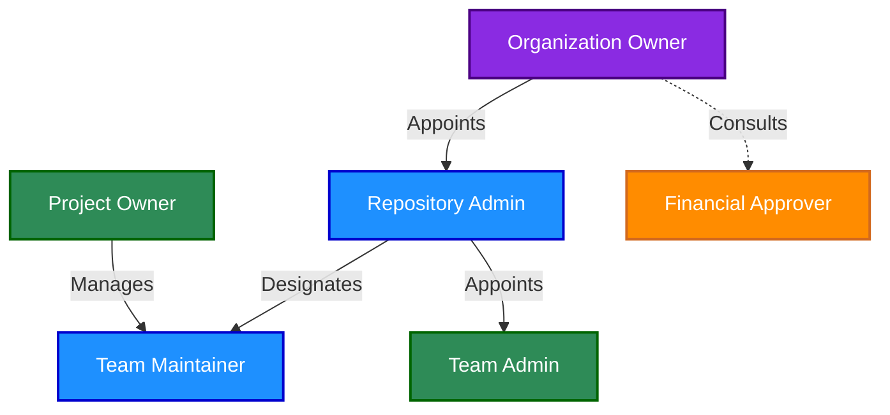
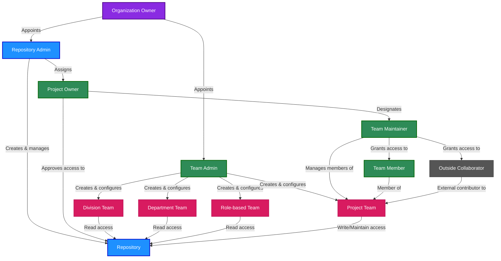

# GitHub Governance Roles

This document defines all roles involved in the governance of GitHub within Norwegian Red Cross. These roles span across repository management, team administration, and the request/approval process.

## Version Information
| Version | Date | Description |
|---------|------|-------------|
| 1.0 | 2023-05-20 | Initial documentation |
| 2.0 | 2023-05-20 | Standardized terminology and added cross-references |
| 2.1 | 2023-05-20 | Added team types and consolidated Outside Collaborator role |
| 2.2 | 2023-05-20 | Improved role relationship diagram and explanations |
| 2.3 | 2023-05-20 | Added Role-based Teams definition |

## Overview of Roles

The following diagram illustrates the relationship between key roles in our GitHub governance structure:

**Role Relationship Explanation:**

- **Solid Arrows (→) represent direct appointment or management authority:**
  - **Organization Owners appoint Repository Admins** - They select trusted individuals to manage repositories across the organization
  - **Repository Admins designate Team Maintainers** - They assign people who can manage team membership for specific repositories
  - **Repository Admins appoint Team Admins** - They select individuals responsible for overall team structure management
  - **Project Owners manage Team Maintainers** - They oversee the team maintainers for their specific projects

- **Dotted Arrows (⇢) represent consultation or advisory relationships:**
  - **Organization Owners consult with Financial Approvers** - They work together on licensing costs and budget approvals

- **Color Coding Indicates Role Categories:**
  - **Purple**: Organization-level roles (Organization Owner)
  - **Blue**: Repository-focused roles (Repository Admin, Team Maintainer)
  - **Green**: Team management roles (Team Admin, Project Owner)
  - **Orange**: Financial governance roles (Financial Approver)

## Organization-Level Roles

### Organization Owner
- **Definition**: Individual with highest level of permissions, responsible for the overall GitHub organization.
- **Responsibilities**:
  - Managing billing and enterprise settings
  - Adding/removing Repository Admins
  - Configuring organizational security settings
  - Setting up organizational policies
- **Number of Users**: Limited group (2-3 people)
- **GitHub Permission Level**: Owner at organization level

### Repository Admin
- **Definition**: Trusted individual responsible for repository governance across the organization.
- **Responsibilities**:
  - Creating new repositories following organizational naming conventions
  - Setting up branch protection rules and security settings
  - Configuring initial permissions and access controls
  - Establishing CI/CD workflows and quality gates
  - Ensuring all repositories have required documentation
  - Managing repository lifecycle (archiving, deletion)
- **Number of Users**: 5-7 trusted members with strong Git/GitHub knowledge
- **GitHub Permission Level**: Admin on repositories

### Team Admin
- **Definition**: Individual responsible for managing GitHub team structures and memberships.
- **Responsibilities**:
  - Creating and configuring teams
  - Adding users to appropriate teams based on requests
  - Ensuring correct team hierarchies
  - Provisioning GitHub access for new users
  - Managing Outside Collaborator relationships
- **Number of Users**: Small group (3-5 people)
- **GitHub Permission Level**: Admin for team management

## Repository and Team-Level Roles

### Project Owner
- **Definition**: Person who owns and is responsible for a repository or project.
- **Responsibilities**:
  - Approving repository creation requests
  - Defining repository purpose and access requirements
  - Validating team composition for repositories
  - Ensuring repository follows organizational standards
  - Approving repository access requests
- **Number of Users**: Multiple (one per project)
- **GitHub Permission Level**: Usually Maintain on their repositories

### Team Maintainer
- **Definition**: Person who can manage a team's membership and settings.
- **Responsibilities**:
  - Adding/removing team members
  - Creating team discussions
  - Managing day-to-day team activities
  - Updating team descriptions and visibility
- **Number of Users**: Multiple (one or more per team)
- **GitHub Permission Level**: Team Maintainer + Write or Maintain on specific repositories

### Team Member
- **Definition**: Regular contributor to a repository or project.
- **Responsibilities**:
  - Contributing code to repositories
  - Participating in team discussions
  - Reviewing pull requests
  - Following contribution guidelines
- **Number of Users**: Many
- **GitHub Permission Level**: Usually Write permission

## External Contributor Roles

### Outside Collaborator
- **Definition**: External contributor (non-redcross.no) with repository-specific access.
- **Characteristics**:
  - Uses personal GitHub account
  - Does not authenticate through SSO
  - Not a member of the GitHub organization
- **Responsibilities**:
  - Contributing to specific repositories only
  - Following contribution guidelines
  - Participating in project discussions
- **Number of Users**: Varies by project
- **GitHub Permission Level**: Repository-specific (usually Write)

## Approval and Governance Roles

### Financial Approver (Cost Center Manager)
- **Definition**: Manager responsible for approving the financial aspects of GitHub licenses.
- **Responsibilities**:
  - Approving costs for GitHub Enterprise licenses ($15 per user for SSO)
  - Budget management for GitHub expenses
  - Authorizing user access from a cost perspective
- **Number of Users**: Multiple (one per department/division)
- **GitHub Permission Level**: N/A (ServiceNow role)

## User Types

### Internal User
- **Definition**: Employee or consultant with a redcross.no account.
- **Characteristics**:
  - Has redcross.no email
  - Authenticates through SSO with Okta
  - Automatically assigned to organizational structure teams
  - Full member of the GitHub organization
- **GitHub Permission Level**: Varies based on team membership

## Team Types

### Division Team
- **Definition**: Level 1 team providing Read access to division members.
- **Purpose**:
  - Provides organization-wide visibility to division members
  - Enables access to relevant repositories across the division
- **Naming Convention**: "[Division Name] Team" (e.g., "Hovedkontor Team")
- **Membership**:
  - All members of a division are automatically added
  - Maintained automatically via HR system integration
- **GitHub Permission Level**: Read access to division-specific repositories

### Department Team
- **Definition**: Level 2 team providing Read access to department members.
- **Purpose**:
  - Provides targeted visibility to department members
  - Ensures department-specific repositories can be seen by all department members
- **Naming Convention**: "[Division Abbreviation] [Department Name] Team" (e.g., "HK IT Department Team")
- **Membership**:
  - All members of a department are automatically added
  - Nested under their respective division teams
  - Maintained automatically via HR system integration
- **GitHub Permission Level**: Read access to department-specific repositories

### Role-based Team
- **Definition**: Cross-organizational team based on job roles or functions.
- **Purpose**:
  - Groups users with similar job functions across divisions
  - Provides access to specialized repositories relevant to specific roles
  - Facilitates functional collaboration across organizational boundaries
- **Naming Convention**: "[Role Name] Team" (e.g., "Developers Team", "UX Designers Team")
- **Membership**:
  - Users with the same job function across divisions/departments
  - Can be automatically assigned based on HR role attributes
  - May be supplemented with manual assignments
- **GitHub Permission Level**: Typically Read access to function-specific repositories

### Project Team
- **Definition**: Cross-organizational team providing Write/Maintain access to repository contributors.
- **Purpose**:
  - Enables active contribution to specific repositories
  - Allows members from any division or department to collaborate
- **Naming Convention**: "[Division]-[Product Area]-Team" (e.g., "HK-Donor-Management-Team")
- **Membership**:
  - Managed by Project Owners and Team Maintainers
  - Can include members from any division or department
  - Can include Outside Collaborators
- **GitHub Permission Level**: Write or Maintain access to specific repositories

## Role Relationships and Access Model

The following diagram illustrates the practical relationship between roles, teams, and repository access:

**Access Model:**
- Division and Department Teams provide Read-only access to repositories
- Role-based Teams provide Read access to role-specific repositories
- Project Teams provide Write or Maintain access to specific repositories
- Team members can be Internal Users or Outside Collaborators
- Repository Admins have Admin access to repositories
- Project Owners typically have Maintain access to their repositories

## GitHub's Official Permission Levels

For reference, GitHub defines the following permission levels:

| GitHub Role | Description | Typical Use |
|-------------|-------------|-------------|
| Read | Can read and clone the repository | For team members who only need to view code |
| Triage | Read + can manage issues and PRs | For team members who help manage projects but don't write code |
| Write | Triage + can push to non-protected branches | For developers actively working on the code |
| Maintain | Write + can manage repository settings (except dangerous ones) | For project managers and tech leads |
| Admin | Full control including deletion and team access | For Repository Admins |

## Role Assignment Matrix

The following matrix shows which roles can assign other roles:

| Role | Can Assign |
|------|------------|
| Organization Owner | Repository Admin, Team Admin, Financial Approver |
| Repository Admin | Project Owner, Team Maintainer |
| Team Admin | Team Member, Outside Collaborator |
| Project Owner | Team Maintainer (for their projects) |
| Team Maintainer | Team Member (for their teams) |

## ServiceNow Request Process Roles

### Repository Requester
- **Definition**: Person who initiates a repository creation request.
- **Responsibilities**:
  - Completing the repository request form in ServiceNow
  - Providing required details about repository purpose and team
  - Following up on request status

### GitHub Access Requester
- **Definition**: Person who initiates a GitHub access request.
- **Responsibilities**:
  - Completing the GitHub access request form in ServiceNow
  - Providing justification for GitHub access
  - Following up on request status

## Related Documents

For more information on related topics, please refer to:

- [02-github-internal-external.md](./02-github-internal-external.md) - Detailed information on internal and outside collaborator users
- [03-github-provisioning.md](./03-github-provisioning.md) - How users are provisioned to GitHub
- [04-github-repository-governance.md](./04-github-repository-governance.md) - Repository administration structure
- [06-github-servicenow.md](./06-github-servicenow.md) - ServiceNow request workflows