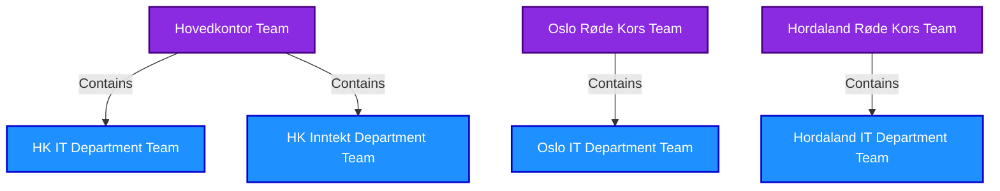
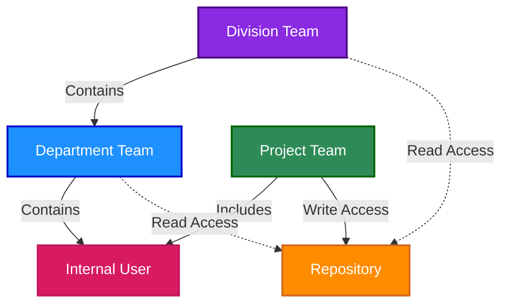

# Internal Users and Outside Collaborators in GitHub

## Version Information
| Version | Date | Description |
|---------|------|-------------|
| 1.0 | 2023-05-20 | Initial documentation |
| 1.1 | 2023-05-20 | Standardized terminology and improved diagrams |

## Overview

Norwegian Red Cross's GitHub organization accommodates two distinct user types to balance security and collaboration:

1. **[Internal Users](./01-github-governance-roles.md#internal-user)**: Employees and consultants with redcross.no accounts
2. **[Outside Collaborators](./01-github-governance-roles.md#outside-collaborator)**: Pro-bono contributors, volunteers, and partners

This document outlines how these user types access repositories and collaborate within our GitHub organization.

## Access Model Overview

Our access model follows these principles:

1. **Organizational Structure Teams**: Provide Read-only access for visibility
   - Based on our 2-level hierarchy (divisions and departments)
   - Automatically maintained through HR/Okta synchronization
   - Ensures everyone can see relevant repositories

2. **Project Teams**: Provide Write/Maintain access for contributors
   - Created for specific repositories or projects
   - Managed by [Repository Admins](./01-github-governance-roles.md#repository-admin) and [Team Maintainers](./01-github-governance-roles.md#team-maintainer)
   - Include people actively working on the project

## 2-Level Organizational Hierarchy

Our organizational structure in GitHub mirrors our 2-level hierarchy:

**Figure 1: Organizational Hierarchy Structure**

## Internal Users

### Characteristics

[Internal Users](./01-github-governance-roles.md#internal-user) are:
- Employees and consultants of Norwegian Red Cross
- Have redcross.no email accounts
- Authenticate through Single Sign-On (SSO) with Okta
- Full members of the GitHub organization

### Access Model

[Internal Users](./01-github-governance-roles.md#internal-user) access GitHub through:
- Single Sign-On (SSO) integration with Okta
- Authentication using their redcross.no credentials
- Automatic team assignments based on organizational structure
- Read access to repositories within their division or department
- Write/Maintain access only through project team membership

### Team Structure for Internal Users

[Internal Users](./01-github-governance-roles.md#internal-user) are assigned to teams following our 2-level hierarchy:

1. **[Division Team](./01-github-governance-roles.md#division-team) (Level 1)**
   - Users are assigned to their division team
   - Examples: "Hovedkontor Team", "Oslo Røde Kors Team"
   - Provides Read access to division-wide repositories

2. **[Department Team](./01-github-governance-roles.md#department-team) (Level 2)**
   - Users are assigned to their department team
   - Examples: "HK IT Department Team", "Oslo IT Department Team" 
   - Provides Read access to department-specific repositories

3. **[Project Team](./01-github-governance-roles.md#project-team) (for contribution access)**
   - Users are manually assigned to project teams
   - Provides Write/Maintain access to specific repositories
   - Can include members from any division or department

### Participation in Development

[Internal Users](./01-github-governance-roles.md#internal-user) can:
- View repositories in their division or department (Read access)
- Contribute to repositories by joining specific project teams (Write/Maintain access)
- Create repositories (if they are [Repository Admins](./01-github-governance-roles.md#repository-admin))
- Manage projects and repositories according to their assigned roles
- Participate in all aspects of the development lifecycle

### Benefits

The [Internal User](./01-github-governance-roles.md#internal-user) approach provides:
- Centralized identity management
- Automated basic access (Read) based on organizational structure
- Clear separation between viewing and contribution rights
- Seamless integration with other organizational tools

## Outside Collaborators

### Characteristics

[Outside Collaborators](./01-github-governance-roles.md#outside-collaborator) are:
- Pro-bono contributors
- Volunteers
- Partners
- Contractors not requiring redcross.no accounts
- Use their personal GitHub accounts

### Access Model

[Outside Collaborators](./01-github-governance-roles.md#outside-collaborator) access GitHub as:
- External contributors to specific repositories
- They authenticate with their personal GitHub accounts
- They are granted access to specific repositories only
- They do not need to authenticate through Okta SSO
- They are added to project teams for specific repositories

### Participation in Development

[Outside Collaborators](./01-github-governance-roles.md#outside-collaborator) can:
- Access only the specific repositories they're invited to
- Join project teams with Write/Maintain permissions
- Create issues and pull requests
- Participate in code reviews
- Collaborate on development tasks

### Benefits

The [Outside Collaborator](./01-github-governance-roles.md#outside-collaborator) approach provides:
- Low barrier to entry for contributors
- No need for additional accounts
- No consumption of paid GitHub seats
- Straightforward onboarding process
- Repository-specific access control

## Collaboration Models

The two user types enable different collaboration models within the same repositories:

### Internal Team Collaboration

[Internal Users](./01-github-governance-roles.md#internal-user) rely on a two-tier access model with our 2-level hierarchy:
- [Division Teams](./01-github-governance-roles.md#division-team) and [Department Teams](./01-github-governance-roles.md#department-team) provide Read access (visibility)
- [Project Teams](./01-github-governance-roles.md#project-team) provide Write/Maintain access (contribution)

**Figure 2: Internal User Access Model with 2-Level Hierarchy**

### Outside Collaborator Model

[Outside Collaborators](./01-github-governance-roles.md#outside-collaborator) work through project teams and specific repositories:

**Figure 3: Outside Collaborator Access Model**

## Security and Governance

The dual-access model maintains security through:

1. **Clear separation of access levels**:
   - Read access based on 2-level organizational structure (internal)
   - Write/Maintain access based on project participation (internal and outside collaborators)
   - Repository-specific permissions for outside collaborators

2. **Role-based permissions**:
   - [Repository Admins](./01-github-governance-roles.md#repository-admin) control repository creation and team assignments
   - [Team Maintainers](./01-github-governance-roles.md#team-maintainer) manage team membership
   - Branch protection rules enforce code quality for all contributors

3. **Access review processes**:
   - Regular audits of outside collaborator access
   - Automatic updates to organizational team membership
   - Periodic review of project team composition

## Best Practices for Mixed Teams

When [Internal Users](./01-github-governance-roles.md#internal-user) and [Outside Collaborators](./01-github-governance-roles.md#outside-collaborator) work together:

1. **Repository settings**:
   - Branch protection rules apply to all contributors equally
   - Required reviews ensure code quality
   - Status checks enforce testing and CI requirements

2. **Communication**:
   - Use repository discussions for project communication
   - Ensure outside collaborators are included in relevant conversations
   - Document decisions and requirements clearly

3. **Contribution workflow**:
   - Establish consistent contribution guidelines
   - Document development processes for all contributors
   - Provide clear onboarding for both user types

This dual approach allows Norwegian Red Cross to maintain security and governance while benefiting from the skills and contributions of the broader community.

## Related Documents

For more information on related topics, please refer to:

- [01-github-governance-roles.md](./01-github-governance-roles.md) - Detailed roles and team type definitions
- [03-github-provisioning.md](./03-github-provisioning.md) - User provisioning processes
- [04-github-repository-governance.md](./04-github-repository-governance.md) - Repository access structure
- [08-github-security-standards.md](./08-github-security-standards.md) - Security controls for repositories