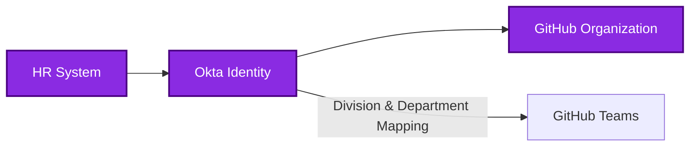
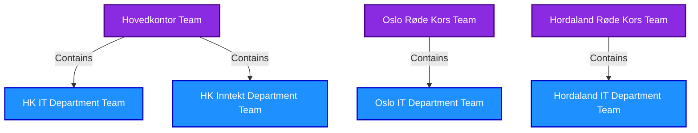

# GitHub User Provisioning

## Version Information
| Version | Date | Description |
|---------|------|-------------|
| 1.0 | 2023-05-20 | Initial documentation |
| 1.1 | 2023-05-20 | Added links to role and team type definitions |

This document explains how users are provisioned to the Norwegian Red Cross GitHub organization, with a focus on the integration between HR systems, Okta, and GitHub.

## Overview

User provisioning for our GitHub organization follows an automated flow that ensures proper access management throughout the employee lifecycle:

**Figure 1: User Provisioning Flow**

## Team Types

Our GitHub organization uses four types of teams:

* **[Division Teams](./01-github-governance-roles.md#division-team)** (Level 1)
  - Top-level teams based on organizational divisions
  - Example: "Hovedkontor Team", "Oslo Røde Kors Team"
  - Includes employees who need read access to division repositories
  - Has access to all repositories within their division

* **[Department Teams](./01-github-governance-roles.md#department-team)** (Level 2)
  - Nested under division teams
  - Example: "HK IT Department Team", "Oslo IT Department Team"
  - Includes employees who need read access to department repositories
  - Has access to repositories relevant to their department

* **[Role-based Teams](./01-github-governance-roles.md#role-based-team)**
  - Cross-organizational teams based on job roles
  - Example: "Developers Team", "Project Managers Team"
  - Manually managed teams that include members across different divisions/departments
  - Has access to repositories based on their role requirements

* **[Project Teams](./01-github-governance-roles.md#project-team)**
  - Manually managed teams for specific projects
  - Example: "HK-Donor-Management-Team"
  - Has access to specific repositories related to their project

## HR System as Source of Truth

Our HR system serves as the primary source of truth for all user data:

1. **User Identity Information**:
   - Basic user details (name, email)
   - Employment status (active, on leave, terminated)
   - Start and end dates

2. **Organizational Metadata**:
   - Division assignment (Level 1)
   - Department assignment (Level 2)
   - Job title and role
   - Reporting structure

3. **User Lifecycle Events**:
   - Hiring (creates new user accounts)
   - Transfers (updates organizational data)
   - Departures (triggers account deactivation)

## Okta Integration

Okta serves as our identity provider and handles synchronization between HR and GitHub:

1. **HR to Okta Synchronization**:
   - User profile creation based on HR data
   - Attribute mapping from HR to Okta profile
   - Group assignments based on organizational structure

2. **Authentication Management**:
   - SSO credentials for redcross.no accounts
   - Multi-factor authentication policies
   - Password policies and management

3. **Access Management**:
   - Application assignment (who gets GitHub access)
   - Group-based access controls
   - Role-based permissions

## GitHub Provisioning via SCIM

User accounts and team memberships in GitHub are managed through SCIM (System for Cross-domain Identity Management):

1. **User Account Provisioning**:
   - Automatic creation of GitHub accounts
   - Profile updates when HR data changes
   - Account deactivation upon termination

2. **Team Membership Automation**:
   - Mapping from Okta groups to GitHub teams
   - Automated team assignments based on HR attributes
   - Team hierarchy alignment with organizational structure

## 2-Level Team Structure Based on HR Data

GitHub teams for [Internal Users](./01-github-governance-roles.md#internal-user) are structured to align with our 2-level HR system hierarchy:

**Figure 2a: Organizational Team Structure**

**Figure 2b: Role-Based Teams**

1. **[Division Team](./01-github-governance-roles.md#division-team) (Level 1)**:
   - Mapped from organizational divisions in HR
   - Examples: "Hovedkontor Team", "Oslo Røde Kors Team", "Hordaland Røde Kors Team"
   - All employees in a division are automatically added

2. **[Department Team](./01-github-governance-roles.md#department-team) (Level 2)**:
   - Mapped from departmental structure in HR
   - Examples: "HK IT Department Team", "HK Inntekt Department Team", "Oslo IT Department Team"
   - Nested under their respective division teams

3. **[Role-based Team](./01-github-governance-roles.md#role-based-team) (Cross-organizational)**:
   - Mapped from job roles or responsibilities in HR
   - Examples: "Developers Team", "Project Managers Team", "UX Designers Team"
   - Used for cross-divisional functional grouping

4. **[Project Team](./01-github-governance-roles.md#project-team) (Manually managed)**:
   - Require manual management by [Repository Admins](./01-github-governance-roles.md#repository-admin) or [Team Maintainers](./01-github-governance-roles.md#team-maintainer)
   - Membership can be a mix of automated assignments and manual additions
   - Used for repository-specific contribution access

## Attribute Mapping Strategy

User attributes flow from HR to GitHub via Okta following this mapping pattern:

| HR System Attribute | Okta Attribute | GitHub Information |
|---------------------|----------------|-------------------|
| Employee Number | employeeNumber | N/A (internal reference) |
| Full Name | displayName | Display Name |
| Email | email | Primary Email |
| Division | division | [Division Team](./01-github-governance-roles.md#division-team) Membership (Level 1) |
| Department | department | [Department Team](./01-github-governance-roles.md#department-team) Membership (Level 2) |
| Job Title | title | Profile Information |
| Job Role | role | [Role-based Team](./01-github-governance-roles.md#role-based-team) Membership |
| Manager | manager | N/A (for future use) |

## Team Naming Convention

To maintain consistency with our 2-level structure, teams will be named according to these patterns:

1. **[Division Teams](./01-github-governance-roles.md#division-team) (Level 1)**:
   - Format: "[Division Name] Team"
   - Examples: "Hovedkontor Team", "Oslo Røde Kors Team"

2. **[Department Teams](./01-github-governance-roles.md#department-team) (Level 2)**:
   - Format: "[Division Abbreviation] [Department Name] Team"
   - Examples: "HK IT Department Team", "Oslo IT Department Team"

3. **[Role-based Teams](./01-github-governance-roles.md#role-based-team)**:
   - Format: "[Role Name] Team"
   - Examples: "Developers Team", "Project Managers Team"

4. **[Project Teams](./01-github-governance-roles.md#project-team)**:
   - Format: "[Division]-[Product Area]-Team"
   - Examples: "HK-Donor-Management-Team", "Oslo-Volunteer-Portal-Team"

## Handling Special Cases

Some special scenarios require specific handling in the provisioning process:

1. **Contractors and Consultants**:
   - Created in HR system with special status
   - Provisioned normally through the same flow as employees
   - May have time-limited access based on contract dates

2. **Multiple Department Assignments**:
   - Users with roles across multiple departments
   - Mapped to all relevant department teams
   - Primary department designated in HR system

3. **Manual Overrides**:
   - Process for handling exceptions
   - [Repository Admins](./01-github-governance-roles.md#repository-admin) can make manual team assignments
   - Tracking system for manual assignments

## User Lifecycle Management

The provisioning system handles the complete employee lifecycle:

1. **Onboarding**:
   - HR creates user record → automatically provisioned to Okta → automatically provisioned to GitHub
   - User receives initial access based on division and department
   - Teams are automatically assigned based on organizational data

2. **Role Changes and Transfers**:
   - HR updates user record → changes sync to Okta → changes reflect in GitHub
   - Team memberships automatically update based on new division/department
   - Access levels adjust according to new responsibilities

3. **Offboarding**:
   - HR updates status to terminated → Okta deactivates account → GitHub access revoked
   - Automatic removal from teams
   - Contributions remain attributed to the user account

## Provisioning Outside Collaborators

[Outside Collaborators](./01-github-governance-roles.md#outside-collaborator) (pro-bono contributors, volunteers, partners) follow a different process:

1. **Manual Invitation**:
   - Not provisioned through HR/Okta flow
   - Added as [Outside Collaborators](./01-github-governance-roles.md#outside-collaborator) to specific repositories
   - Managed by [Repository Admins](./01-github-governance-roles.md#repository-admin) or [Project Owners](./01-github-governance-roles.md#project-owner)

2. **Authentication**:
   - Use personal GitHub accounts
   - Not subject to SSO requirements
   - Authenticate directly with GitHub

This separate flow for [Outside Collaborators](./01-github-governance-roles.md#outside-collaborator) ensures security while maintaining flexibility for collaboration with contributors outside the organization.

## Related Documents

For more information on related topics, please refer to:

- [01-github-governance-roles.md](./01-github-governance-roles.md) - Detailed roles and team type definitions
- [02-github-internal-external.md](./02-github-internal-external.md) - Internal and outside collaborator user types
- [04-github-repository-governance.md](./04-github-repository-governance.md) - Repository access structure
- [06-github-servicenow.md](./06-github-servicenow.md) - ServiceNow integration for provisioning requests