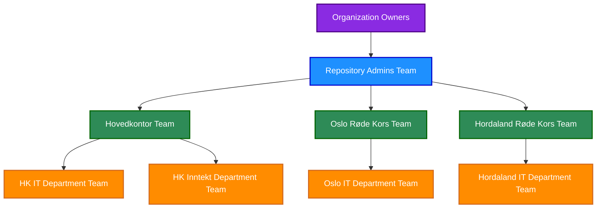
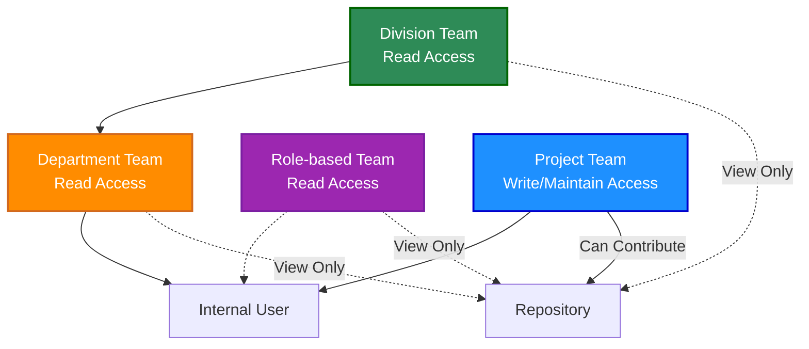
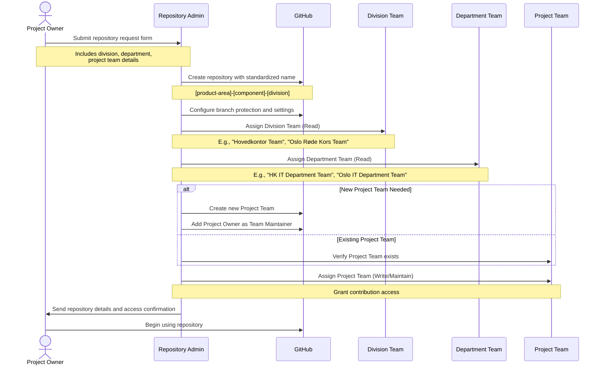
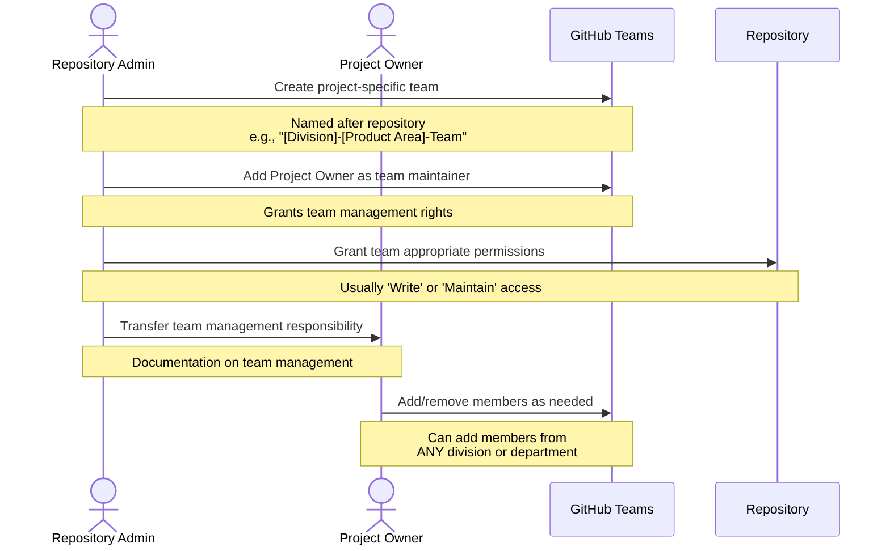

# Repository Governance in GitHub

## Version Information
| Version | Date | Description |
|---------|------|-------------|
| 1.0 | 2023-05-20 | Initial documentation |
| 2.0 | 2023-05-20 | Standardized terminology and added cross-references |
| 2.1 | 2023-05-20 | Added links to role definitions and included Role-based Team in permissions matrix |

## Repository Administration Structure

GitHub's permission model allows us to create a governance structure to maintain consistency, security, and proper governance across all repositories. This document outlines how we'll use GitHub's built-in roles to implement repository governance.

## Organization Owners and Repository Admins

Organization Owners have the highest level of permissions, while a dedicated team of Repository Admins will handle day-to-day repository governance:

**Figure 1: Repository Administration Structure with 2-Level Organizational Hierarchy**

*Note: All roles and team types referenced in this diagram are formally defined in [01-github-governance-roles.md](./01-github-governance-roles.md).*

### [Organization Owner](./01-github-governance-roles.md#organization-owner)
- Limited group (2-3 people) with full administrative access to the organization
- Can change organization settings, billing, and security policies
- Ultimate oversight of all repositories and teams

### [Repository Admin](./01-github-governance-roles.md#repository-admin) Team
- A team with Admin permission level across repositories
- Members from different divisions of the organization
- Responsible for repository creation and governance
- 5-7 trusted members with strong Git/GitHub knowledge

## Repository Access Based on Organizational Structure

With our 2-level organizational structure, Repository Admins will implement the following access model:

**Figure 2: Repository Access Model with 2-Level Organizational Structure**

*Note: All roles and team types referenced in this diagram are formally defined in [01-github-governance-roles.md](./01-github-governance-roles.md).*

### Access Assignment Strategy

1. **[Division Team](./01-github-governance-roles.md#division-team) Access (Level 1)**
   - Provides organization-wide visibility to division members
   - All members of a division get Read access to relevant repositories
   - Examples: "Hovedkontor Team", "Oslo Røde Kors Team", "Hordaland Røde Kors Team"

2. **[Department Team](./01-github-governance-roles.md#department-team) Access (Level 2)**
   - Provides more targeted visibility to department members
   - All members of a department get Read access to department-specific repositories
   - Examples: "HK IT Department Team", "Oslo IT Department Team" within each division

3. **[Project Team](./01-github-governance-roles.md#project-team) Access (Cross-Organizational)**
   - Provides contribution access (Write/Maintain) to actual contributors
   - Members can come from any division or department
   - Created specifically for repository contribution needs

## Repository Creation and Team Assignment Flow

The following diagram illustrates how Repository Admins will create repositories and assign teams based on the 2-level organizational structure:

**Figure 3: Repository Creation and Team Assignment Flow**

*Note: All roles and team types referenced in this diagram are formally defined in [01-github-governance-roles.md](./01-github-governance-roles.md).*

## Project Team Creation and Management

For project teams that need Write/Maintain access, Repository Admins will follow this process:

### Project Team Setup Process

**Figure 4: Project Team Setup and Delegation**

*Note: All roles and team types referenced in this diagram are formally defined in [01-github-governance-roles.md](./01-github-governance-roles.md).*

## Team Permission Matrix for 2-Level Structure

| Team Type | Level | Permission Level | Purpose |
|-----------|-------|------------------|---------|
| [Division Team](./01-github-governance-roles.md#division-team) | Level 1 | Read | Visibility across division |
| [Department Team](./01-github-governance-roles.md#department-team) | Level 2 | Read | Department-specific visibility |
| [Role-based Team](./01-github-governance-roles.md#role-based-team) | Cross-Organizational | Read | Function-specific access |
| [Project Team](./01-github-governance-roles.md#project-team) | Cross-Organizational | Write/Maintain | Repository contribution |
| [Repository Admin](./01-github-governance-roles.md#repository-admin) | Organization-wide | Admin | Repository governance |

### Cross-Divisional Collaboration

The 2-level structure with Project and Role-based Teams allows for efficient cross-divisional collaboration:

1. **Members from different divisions** can be added to the same Project Team
2. **IT departments from different divisions** can collaborate on shared repositories
3. **[Outside Collaborators](./01-github-governance-roles.md#outside-collaborator)** can be added to Project Teams (not Division/Department teams)
4. **Users with the same job function** can view repositories relevant to their roles via [Role-based Teams](./01-github-governance-roles.md#role-based-team)

## Best Practices for Repository Team Assignment

1. **Appropriate Visibility**:
   - Always assign the relevant Division and Department teams (Read)
   - For division-specific repositories, assign only the relevant Division team
   - For department-specific repositories, assign both Division and Department teams
   - For function-specific repositories, assign appropriate Role-based Teams

2. **Contribution Access**:
   - Always use Project Teams for Write/Maintain access
   - Never grant Write/Maintain directly to Division or Department teams
   - Keep Project Teams focused on active contributors only

3. **Naming Convention for Teams**:
   - For Project Teams: "[Division]-[Product Area]-Team"
   - For cross-divisional Project Teams: "Cross-[Product Area]-Team"
   - For Role-based Teams: "[Role Name] Team" (e.g., "Developers Team")
   
4. **Regular Access Reviews**:
   - Review Project Team membership quarterly
   - Audit Division and Department team assignments semi-annually
   - Verify that all repositories follow the correct access pattern

## Related Documents

For more information on related topics, please refer to:

- [01-github-governance-roles.md](./01-github-governance-roles.md) - Detailed information on all GitHub roles
- [02-github-internal-external.md](./02-github-internal-external.md) - Internal and external user management
- [05-github-repository-naming.md](./05-github-repository-naming.md) - Repository naming conventions
- [06-github-servicenow.md](./06-github-servicenow.md) - ServiceNow request process