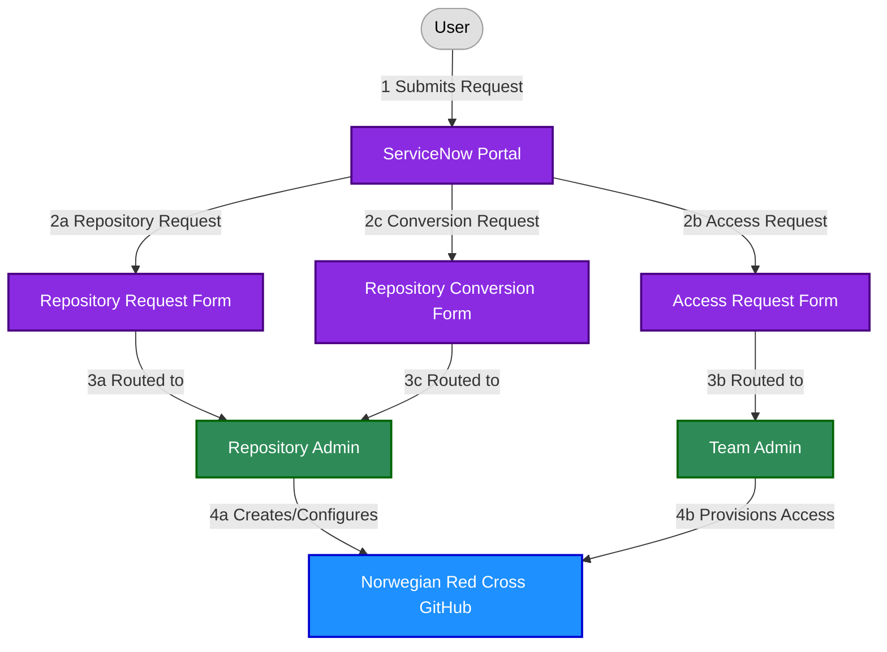
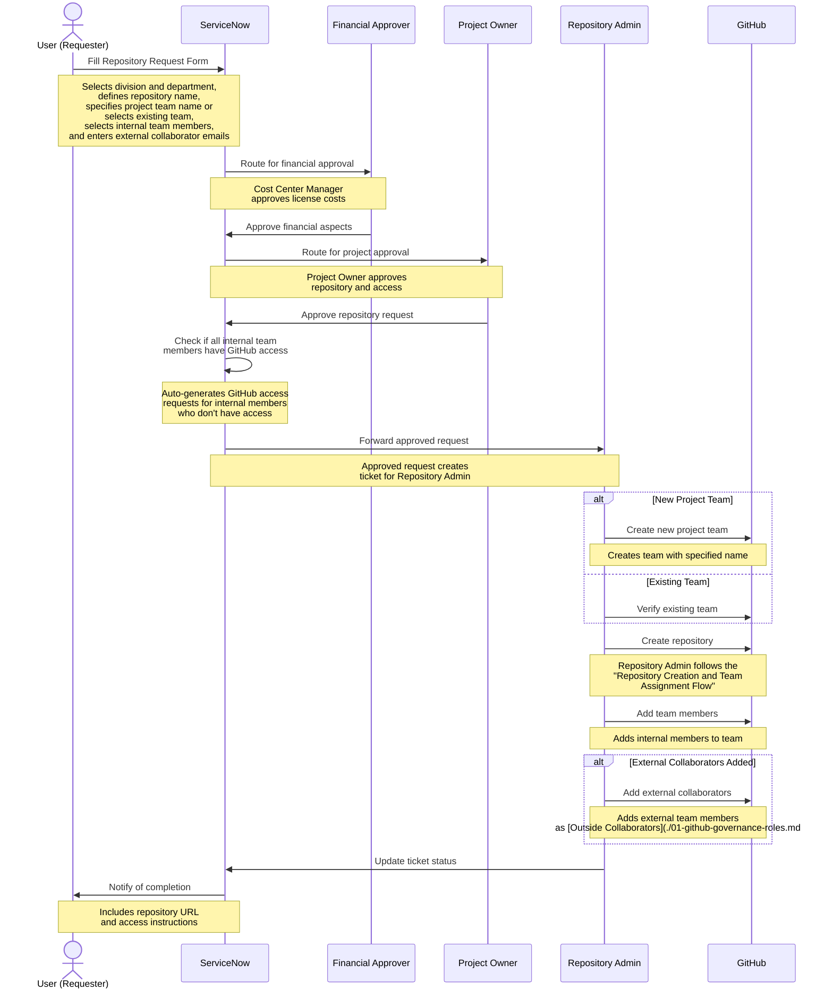
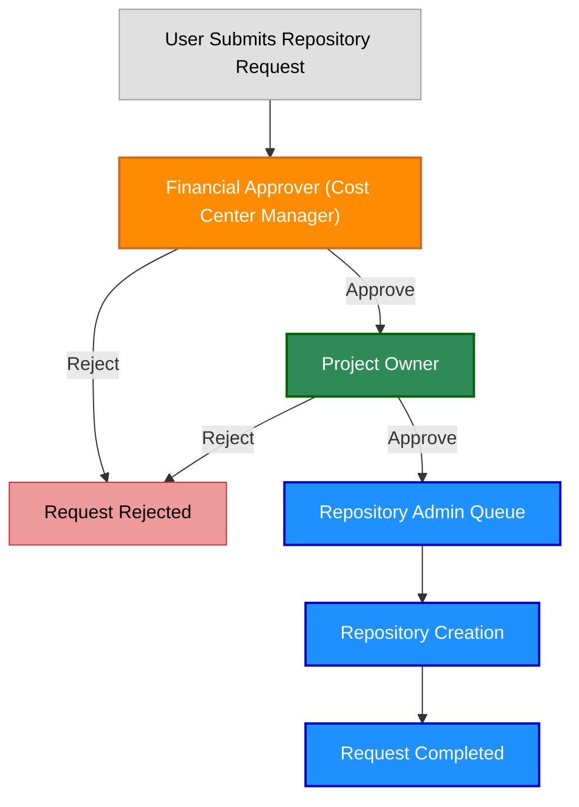
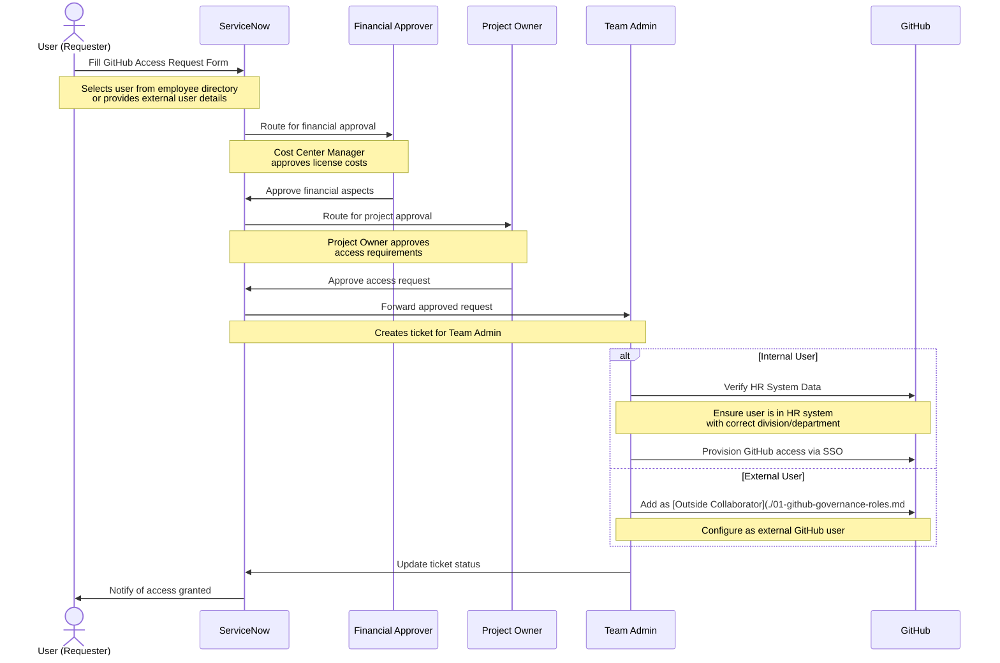
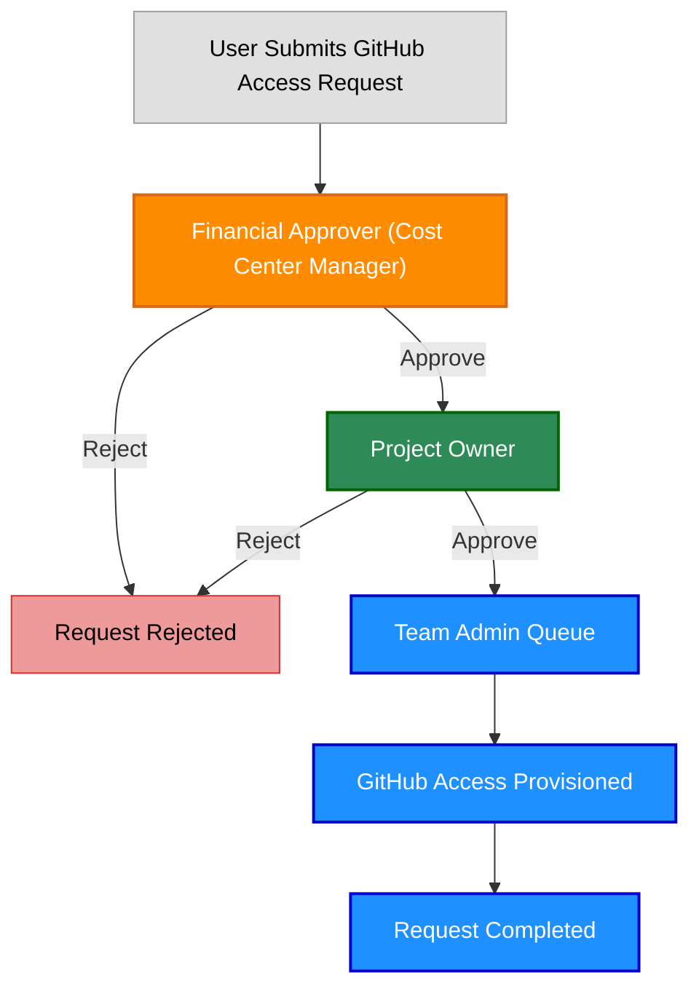
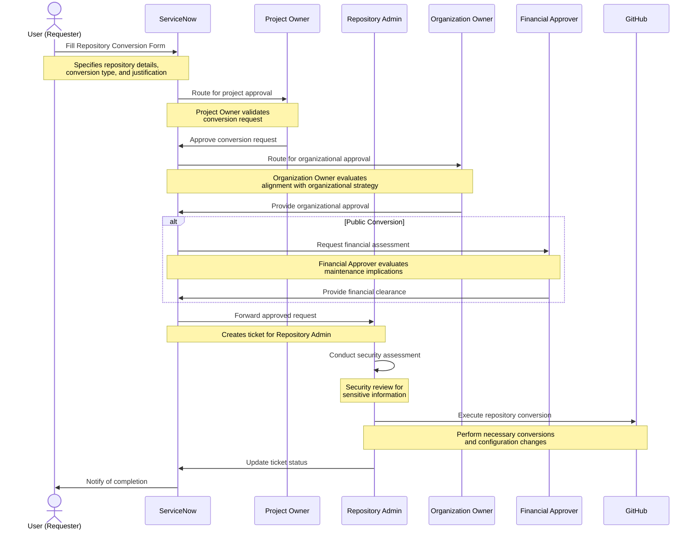

# GitHub ServiceNow Integration

## Version Information
| Version | Date | Description |
|---------|------|-------------|
| 1.0 | 2023-05-20 | Initial documentation |
| 2.0 | 2023-05-20 | Standardized terminology and added cross-references |
| 2.1 | 2023-05-20 | Updated role links and improved diagrams clarity |
| 2.2 | 2023-05-20 | Added repository conversion request flow |

## Overview

Norwegian Red Cross uses ServiceNow as the self-service portal for GitHub-related requests in our "Norwegian Red Cross" GitHub organization. This document outlines the primary ordering flows:

1. **GitHub Repository Request Flow**: How users request new GitHub repositories
2. **GitHub Access Request Flow**: How users request access to GitHub
3. **Repository Conversion Request Flow**: How users request repository conversions (e.g., private to public, platform migrations)

These ServiceNow-based flows ensure proper governance, standardization, and tracking of all GitHub-related requests.

## ServiceNow as the Single Point of Entry

All GitHub repository and access requests must go through ServiceNow to ensure:

- Proper approval workflows
- Standardized information collection
- Complete audit trails
- Integration with existing IT service management processes

**Figure 1: ServiceNow as Single Point of Entry for GitHub Requests**

*Note: The roles referenced in this diagram ([Repository Admin](./01-github-governance-roles.md#repository-admin) and [Team Admin](./01-github-governance-roles.md#team-admin)) are formally defined in the [GitHub Governance Roles](./01-github-governance-roles.md) document.*

### Request Flow Explanation

1. **User Submits Request**: All GitHub requests start with a user accessing the ServiceNow portal
2. **Request Type Selection**:
   - Repository Request: For creating new repositories in the Norwegian Red Cross GitHub organization
   - Access Request: For requesting access to GitHub for users
   - Conversion Request: For converting repositories (e.g., private to public, platform migrations)
3. **Administrative Routing**:
   - Repository requests are routed to [Repository Admins](./01-github-governance-roles.md#repository-admin) after approvals
   - Access requests are routed to [Team Admins](./01-github-governance-roles.md#team-admin) after approvals
   - Conversion requests are routed to [Repository Admins](./01-github-governance-roles.md#repository-admin) after approvals from [Project Owner](./01-github-governance-roles.md#project-owner), [Organization Owner](./01-github-governance-roles.md#organization-owner), and possibly [Financial Approver](./01-github-governance-roles.md#financial-approver-cost-center-manager)
4. **GitHub Configuration**:
   - [Repository Admins](./01-github-governance-roles.md#repository-admin) create and configure repositories in the Norwegian Red Cross GitHub organization
   - [Team Admins](./01-github-governance-roles.md#team-admin) provision user access to GitHub
   - [Repository Admins](./01-github-governance-roles.md#repository-admin) perform repository conversions following [platform selection guidelines](./07-platform-selection-guidelines.md)

## GitHub Repository Request Flow

The repository request flow begins in ServiceNow and feeds into the existing ["Repository Creation and Team Assignment Flow"](./04-github-repository-governance.md#repository-creation-and-team-assignment-flow) within the Norwegian Red Cross GitHub organization, as described in the [04-github-repository-governance.md](./04-github-repository-governance.md) document.

### Repository Request Form Fields

The ServiceNow Repository Request form includes the following fields:

| Field | Description | Example |
|-------|-------------|---------|
| Division | Organizational [division](./01-github-governance-roles.md#division-team) (dropdown from HR system) | Oslo Røde Kors |
| Department | Organizational [department](./01-github-governance-roles.md#department-team) (dropdown from HR system) | IT Department |
| Repository Name | Following [product-area]-[component]-[division] format | volunteer-portal-api-oslo |
| Purpose | Brief description of repository purpose | API for volunteer management application |
| Project Team | New [Project Team](./01-github-governance-roles.md#project-team) name or existing team (dropdown of existing teams + option to create new) | Oslo-Volunteer-Portal-Team |
| Internal Project Team Members | [Internal Users](./01-github-governance-roles.md#internal-user) selected from employee directory | [Selected employees from dropdown] |
| External Project Team Members | [Outside Collaborators](./01-github-governance-roles.md#outside-collaborator) (email addresses) | volunteer@example.com, partner@example.org |
| Special Requirements | Any special configuration needs | Requires specific CI/CD setup |
| Requested For | [Project Owner](./01-github-governance-roles.md#project-owner) who will own the repository | [Selected from employee directory] |

The naming convention for repositories follows the standard defined in [05-github-repository-naming.md](./05-github-repository-naming.md), using the [product-area]-[component]-[division] format. The form provides guidance and examples to help users understand this naming pattern.

The Project Team field allows users to either select an existing team from a dropdown or create a new one by entering a name. New team names should follow the format defined in the [04-github-repository-governance.md](./04-github-repository-governance.md) document: "[Division]-[Product Area]-Team".

Division and Department dropdowns are synchronized with the HR system to ensure consistency across all systems. Internal Project Team Members allows selection directly from the ServiceNow employee directory, while External Project Team Members requires email addresses for outside collaborators. If any selected internal team members do not yet have GitHub access, the system will automatically generate the necessary GitHub access requests as part of the repository creation process.

### Repository Request Process

**Figure 2: GitHub Repository Request Flow via ServiceNow**

*Note: The roles referenced in this diagram ([Financial Approver](./01-github-governance-roles.md#financial-approver-cost-center-manager), [Project Owner](./01-github-governance-roles.md#project-owner), [Repository Admin](./01-github-governance-roles.md#repository-admin), and [Outside Collaborator](./01-github-governance-roles.md#outside-collaborator)) are formally defined in the [GitHub Governance Roles](./01-github-governance-roles.md) document.*

### Repository Request Approval Workflow

The repository request approval process involves multiple stakeholders with different concerns:

**Figure 3: Repository Request Approval Workflow**

*Note: The approval roles ([Financial Approver](./01-github-governance-roles.md#financial-approver-cost-center-manager) and [Project Owner](./01-github-governance-roles.md#project-owner)) are formally defined in the [GitHub Governance Roles](./01-github-governance-roles.md) document.*

1. **[Financial Approver (Cost Center Manager)](./01-github-governance-roles.md#financial-approver-cost-center-manager)**:
   - Responsible for the financial aspect of GitHub licenses
   - Approves the cost implications ($15 per user for SSO access)
   - Usually the department or division manager responsible for the budget

2. **[Project Owner](./01-github-governance-roles.md#project-owner)**:
   - Responsible for the technical and access governance aspects
   - Validates the repository purpose and team composition
   - Verifies that the repository name follows conventions
   - Person who will own and be responsible for the repository

Only after both approvals are received does the request move to the Repository Admin queue for implementation.

## GitHub Access Request Flow

The access request flow manages how users request access to GitHub.

### Access Request Form Fields

The ServiceNow GitHub Access Request form includes the following fields:

| Field | Description | Example |
|-------|-------------|---------|
| User | Person requiring GitHub access (selected from employee directory) | [Selected employee from dropdown] |
| User Type | [Internal User](./01-github-governance-roles.md#internal-user) or [Outside Collaborator](./01-github-governance-roles.md#outside-collaborator) (dropdown) | Internal |
| Division | User's [division](./01-github-governance-roles.md#division-team) (auto-populated from HR system) | Oslo Røde Kors |
| Department | User's [department](./01-github-governance-roles.md#department-team) (auto-populated from HR system) | IT Department |
| Justification | Business reason for GitHub access | Working on development projects |
| Duration | Temporary or permanent access (dropdown) | Permanent |
| Requested For | Person who will receive access (auto-populated from User field) | [Same as User field] |
| Manager | User's manager (automatically populated from HR system) | [Auto-populated from HR data] |

For external users, additional fields appear:
| Field | Description | Example |
|-------|-------------|---------|
| External Email | Email address for external user | volunteer@example.com |
| Organization | Organization the external user belongs to | Partner Organization Name |
| Project | Project the external user will work on | Volunteer Portal |

### Access Request Process

**Figure 4: GitHub Access Request Flow via ServiceNow**

*Note: The roles referenced in this diagram ([Financial Approver](./01-github-governance-roles.md#financial-approver-cost-center-manager), [Project Owner](./01-github-governance-roles.md#project-owner), [Team Admin](./01-github-governance-roles.md#team-admin), and [Outside Collaborator](./01-github-governance-roles.md#outside-collaborator)) are formally defined in the [GitHub Governance Roles](./01-github-governance-roles.md) document.*

### Access Request Approval Workflow

The GitHub access request approval process involves multiple stakeholders with different concerns:

**Figure 5: GitHub Access Request Approval Workflow**

*Note: The approval roles ([Financial Approver](./01-github-governance-roles.md#financial-approver-cost-center-manager) and [Project Owner](./01-github-governance-roles.md#project-owner)) are formally defined in the [GitHub Governance Roles](./01-github-governance-roles.md) document.*

1. **[Financial Approver (Cost Center Manager)](./01-github-governance-roles.md#financial-approver-cost-center-manager)**:
   - Responsible for the financial aspect of GitHub licenses
   - Approves the cost implications ($15 per user for SSO access)
   - Usually the department or division manager responsible for the budget

2. **[Project Owner](./01-github-governance-roles.md#project-owner)**:
   - Responsible for evaluating if the user needs GitHub access
   - Validates the justification for access
   - Ensures access is appropriate for the user's role
   - Person who will be responsible for the user's activities in GitHub

Only after both approvals are received does the request move to the Team Admin queue for implementation.

## Repository Conversion Request Flow

The repository conversion request flow manages how users request conversion of repositories (e.g., from private to public or between platforms).

### Repository Conversion Form Fields

The ServiceNow GitHub Repository Conversion form includes the following fields:

| Field | Description | Example |
|-------|-------------|---------|
| Repository Name | Existing repository name | volunteer-portal-api-oslo |
| Repository URL | Link to the existing repository | https://github.com/norwegianredcross/volunteer-portal-api-oslo |
| Conversion Type | Type of conversion (dropdown) | Private to Public, Azure DevOps to GitHub, etc. |
| Target Platform | Target platform if migrating (dropdown) | GitHub, Azure DevOps |
| Justification | Business reason for conversion | Increasing community involvement |
| Compliance Check | Confirmation of compliance with [public repository guidelines](./07-platform-selection-guidelines.md#public-repository-guidelines-for-github) | [Checkbox] |
| Requested For | [Project Owner](./01-github-governance-roles.md#project-owner) who owns the repository | [Selected from employee directory] |

### Repository Conversion Process

*Note: The roles in this diagram ([Project Owner](./01-github-governance-roles.md#project-owner), [Repository Admin](./01-github-governance-roles.md#repository-admin), [Organization Owner](./01-github-governance-roles.md#organization-owner), and [Financial Approver](./01-github-governance-roles.md#financial-approver-cost-center-manager)) are formally defined in the [GitHub Governance Roles](./01-github-governance-roles.md) document.*

### Repository Conversion Approval Workflow

The repository conversion approval process follows the same pattern as new repository creation with additional security reviews:

1. **[Project Owner](./01-github-governance-roles.md#project-owner)**:
   - Validates the need for repository conversion
   - Confirms ownership and responsibility for the repository
   - Ensures compliance with public repository guidelines (if applicable)

2. **[Organization Owner](./01-github-governance-roles.md#organization-owner)**:
   - Evaluates alignment with organizational strategy
   - Ensures proper consideration of visibility implications
   - Approves any changes to organizational structure

3. **[Financial Approver](./01-github-governance-roles.md#financial-approver-cost-center-manager)** (for public conversions):
   - Evaluates long-term maintenance implications
   - Approves resource allocation for continued support
   - Reviews licensing implications

Only after all approvals are received does the request move to the Repository Admin queue for implementation.

## Related Documents

For more information on related topics, please refer to:

- [01-github-governance-roles.md](./01-github-governance-roles.md) - Roles and responsibilities definitions
- [02-github-internal-external.md](./02-github-internal-external.md) - Internal and external user types
- [03-github-provisioning.md](./03-github-provisioning.md) - User provisioning processes
- [04-github-repository-governance.md](./04-github-repository-governance.md) - Repository governance and team structure
- [05-github-repository-naming.md](./05-github-repository-naming.md) - Repository naming conventions
- [07-platform-selection-guidelines.md](./07-platform-selection-guidelines.md) - Guidelines for platform selection and public repositories
- [08-github-security-standards.md](./08-github-security-standards.md) - Security standards for repositories