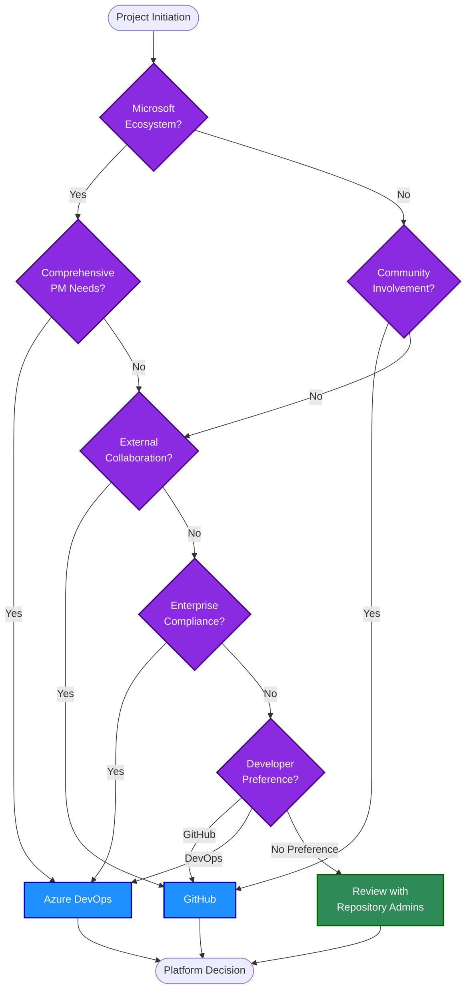
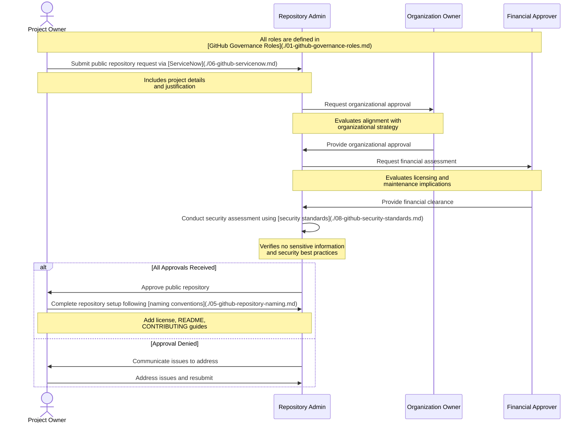

# Platform Selection Guidelines

## Version Information
| Version | Date | Description |
|---------|------|-------------|
| 1.0 | 2023-05-20 | Initial documentation |
| 1.1 | 2023-05-20 | Added links to role definitions and standardized terminology |

## Overview

Norwegian Red Cross maintains both Azure DevOps and GitHub ("Norwegian Red Cross" GitHub organization) as development platforms. This document provides guidance on which platform to use for different project types and when repositories should be made public. Following these guidelines ensures consistency, appropriate governance, and maximizes the benefits of each platform.

## Platform Comparison

| Feature | Azure DevOps | GitHub |
|---------|-------------|--------|
| **Primary Use Cases** | Enterprise projects, integrated Microsoft services | Open source, community collaboration, modern development workflows |
| **Access Management** | AD/AAD integration, fine-grained | SSO via Okta, [team-based](./01-github-governance-roles.md#team-types) |
| **CI/CD** | Azure Pipelines, tight Azure integration | GitHub Actions, flexible integrations |
| **Project Management** | Comprehensive (Boards, Backlogs, Sprints) | Basic (Issues, Projects, Milestones) |
| **Artifact Management** | Built-in artifact repositories | GitHub Packages |
| **Cost Model** | Per-user licensing with enterprise features | Per-user for private repos, free for public repos |
| **External Sharing** | Complex, requires AAD guest accounts | Simple, supports [Outside Collaborators](./01-github-governance-roles.md#outside-collaborator) |

## Decision Framework for Platform Selection

### Use Azure DevOps for projects that:

1. **Require tight Microsoft ecosystem integration**
   - Integrate extensively with other Microsoft services (Azure, Microsoft 365)
   - Use Azure-specific services and deployment targets
   - Leverage Azure identity and access management

2. **Need comprehensive project management**
   - Require detailed work item tracking and custom workflows
   - Use advanced project planning with epics, features, user stories
   - Need detailed reporting and dashboards
   - Utilize velocity tracking and sprint planning

3. **Have strict enterprise compliance requirements**
   - Require specific audit trail capabilities
   - Need detailed access control at the feature level
   - Must comply with specific security frameworks that Azure DevOps supports

4. **Involve legacy systems and integration**
   - Projects migrated from TFS/older DevOps systems
   - Systems requiring extensive TFVC (centralized version control)
   - Integration with older Microsoft technology stacks

### Use GitHub for projects that:

1. **Benefit from community involvement**
   - Open source initiatives
   - Projects seeking external contributors
   - Volunteer-driven development
   - Initiatives that benefit from public visibility

2. **Use modern development workflows**
   - Projects using container-based development
   - Infrastructure as Code (IaC) repositories
   - Projects benefiting from GitHub's developer ecosystem
   - Code that leverages GitHub's social coding features

3. **Need simple external collaboration**
   - Projects involving external partners
   - Collaborative initiatives with other organizations
   - Projects that need simplified onboarding for [Outside Collaborators](./01-github-governance-roles.md#outside-collaborator)
   - Projects benefiting from the [team-based access model](./01-github-governance-roles.md#team-types)

4. **Align with developer preferences**
   - Projects where developer familiarity and preference for GitHub is important
   - Teams that prefer GitHub's developer experience
   - Projects needing to attract developer talent familiar with GitHub

## Public Repository Guidelines for GitHub

Repositories should be made public when they meet the following criteria:

### Mandatory Requirements

1. **No Sensitive Information**
   - Contains no credentials, tokens, or secrets
   - Excludes internal infrastructure details
   - Contains no personally identifiable information (PII)
   - Excludes proprietary business logic, algorithms, or confidential roadmaps

2. **Legal Compliance**
   - Has appropriate open source license
   - All dependencies comply with license requirements
   - No intellectual property concerns
   - Complies with export control regulations

3. **Quality Standards**
   - Follows coding standards and best practices
   - Has complete and accurate [documentation standards](./09-github-documentation-standards.md)
   - Includes contribution guidelines
   - Has passed security review by [Repository Admins](./01-github-governance-roles.md#repository-admin)

### Recommended Characteristics

1. **Community Benefit**
   - Provides value to the wider community
   - Solves common problems
   - Demonstrates innovative approaches
   - Serves humanitarian or non-profit purposes

2. **Sustainability**
   - Has resources allocated for maintenance
   - Assigned [Team Maintainers](./01-github-governance-roles.md#team-maintainer) to review contributions
   - Commitment to addressing issues and vulnerabilities by [Project Owner](./01-github-governance-roles.md#project-owner)
   - Long-term support plan approved by [Organization Owner](./01-github-governance-roles.md#organization-owner)

3. **Strategic Alignment**
   - Aligns with Red Cross digital strategy
   - Enhances organizational reputation
   - Demonstrates technical leadership
   - Supports partner collaboration goals

## Decision Process

### Platform Selection Workflow

*Note: The "Repository Admins" referenced in this diagram are defined in the [GitHub Governance Roles](./01-github-governance-roles.md#repository-admin) document.*

### Public Repository Approval Process

*Note: The roles in this diagram are defined in the [GitHub Governance Roles](./01-github-governance-roles.md) document: [Project Owner](./01-github-governance-roles.md#project-owner), [Repository Admin](./01-github-governance-roles.md#repository-admin), [Organization Owner](./01-github-governance-roles.md#organization-owner), and [Financial Approver](./01-github-governance-roles.md#financial-approver-cost-center-manager).*

## Repository Conversion

Existing repositories may be migrated between platforms or converted from private to public when necessary. This requires:

1. **Migration Assessment**
   - Repository content review against [documentation standards](./09-github-documentation-standards.md)
   - Dependency analysis
   - Access control evaluation using [team-based model](./01-github-governance-roles.md#team-types)
   - History preservation planning

2. **Approval Process**
   - Follow the [Repository Conversion Request Flow](./06-github-servicenow.md#repository-conversion-request-flow) through ServiceNow
   - Requires approvals from [Project Owner](./01-github-governance-roles.md#project-owner), [Organization Owner](./01-github-governance-roles.md#organization-owner), and potentially [Financial Approver](./01-github-governance-roles.md#financial-approver-cost-center-manager)
   - Additional security review by [Repository Admins](./01-github-governance-roles.md#repository-admin) for platform migrations
   - Communications plan for public conversions

3. **Technical Migration**
   - Repository transfer process
   - Secrets scanning and removal
   - CI/CD pipeline reconfiguration
   - Access control setup according to the [repository governance model](./04-github-repository-governance.md)
   - [Outside Collaborator](./01-github-governance-roles.md#outside-collaborator) integration updates

## Related Documents

For more information on related topics, please refer to:

- [01-github-governance-roles.md](./01-github-governance-roles.md) - Roles and responsibilities definitions
- [02-github-internal-external.md](./02-github-internal-external.md) - Internal and external user types
- [03-github-provisioning.md](./03-github-provisioning.md) - User provisioning processes
- [04-github-repository-governance.md](./04-github-repository-governance.md) - Repository governance and team structure
- [05-github-repository-naming.md](./05-github-repository-naming.md) - Repository naming conventions
- [06-github-servicenow.md](./06-github-servicenow.md) - ServiceNow request process
- [08-github-security-standards.md](./08-github-security-standards.md) - Security standards for GitHub repositories
- [09-github-documentation-standards.md](./09-github-documentation-standards.md) - Documentation standards for repositories