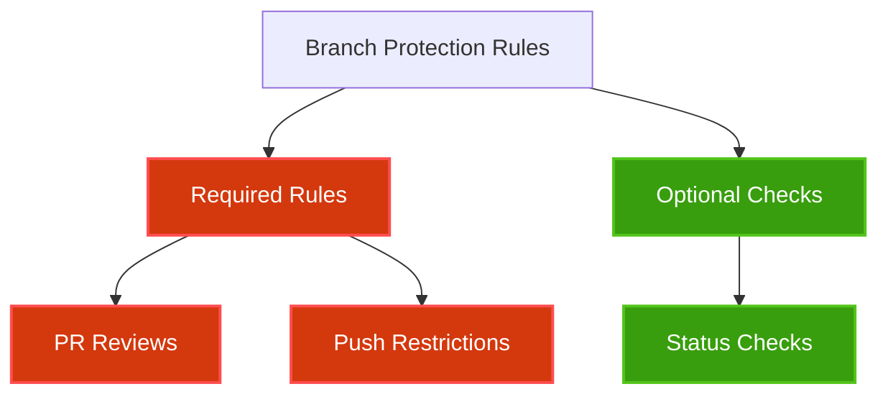
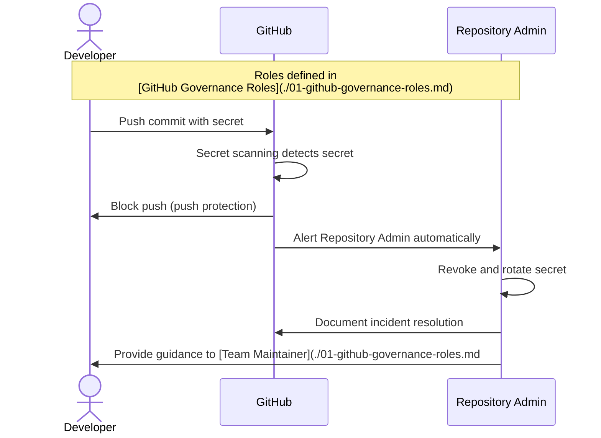

# GitHub Security Standards

## Version Information
| Version | Date | Description |
|---------|------|-------------|
| 1.0 | 2025-05-20 | Initial documentation |
| 1.1 | 2025-05-20 | Added links to role definitions and standardized terminology |

## Overview

This document outlines the security standards and requirements for all repositories in the Norwegian Red Cross GitHub organization, managed by [Repository Admins](./01-github-governance-roles.md#repository-admin) and enforced through branch protection rules. [Project Owners](./01-github-governance-roles.md#project-owner) are responsible for ensuring their repositories comply with these standards, with support from Repository Admins. Following these standards ensures consistent security practices, reduces risk, and protects our code and data.

## Branch Protection Requirements

All repositories must implement the following branch protection rules for the `main` branch:

### Required Protection Rules
- **Require pull request reviews before merging** (mandatory)
  - At least 1 approval required (2 for critical repositories)
  - Dismiss stale pull request approvals when new commits are pushed
  - Require review from Code Owners (defined in [CODEOWNERS template](./templates/CODEOWNERS))

- **Restrict who can push to matching branches**
  - Only allow [Repository Admins](./01-github-governance-roles.md#repository-admin) to push directly to protected branches

### Status Checks (optional)
- If CI/CD is implemented, require status checks to pass before merging
  - Require branches to be up to date before merging
  - Common status checks include:
    - Linting
    - Unit tests
    - Build verification

**Figure 1: Branch Protection Rules Hierarchy**

## Secret Scanning (mandatory for all repositories)

All repositories must have GitHub Advanced Security enabled with secret scanning:

- **Secret scanning features to enable:**
  - Push protection - prevents secrets from being pushed
  - Automated alerts - GitHub has built-in functionality to alert [Repository Admins](./01-github-governance-roles.md#repository-admin) when secrets are detected

GitHub's secret scanning supports detecting various types of secrets automatically, including:
- API keys
- Authentication tokens
- Certificates
- Database connection strings
- Service credentials

### Handling Detected Secrets
1. Immediately revoke the exposed secret
2. Remove the secret from the repository history
3. Document the incident in [ServiceNow](./06-github-servicenow.md)
4. Rotate all potentially affected credentials

**Figure 2: Secret Detection and Remediation Process**

### Security Roles and Responsibilities

Security management is a shared responsibility across different roles:

1. **[Repository Admins](./01-github-governance-roles.md#repository-admin)**:
   - Configure and enforce security settings
   - Respond to critical security alerts
   - Implement repository-level security controls
   - Provide security guidance to teams

2. **[Project Owners](./01-github-governance-roles.md#project-owner)**:
   - Ensure repositories comply with security standards
   - Approve security-related changes
   - Responsible for the overall security posture of their repositories
   - Prioritize security fixes in their development roadmap

3. **[Team Maintainers](./01-github-governance-roles.md#team-maintainer)**:
   - Monitor security alerts for their team's repositories
   - Ensure team members follow secure development practices
   - Coordinate responses to non-critical security issues
   - Review security implications of code changes

## Dependency Management (optional)

Repositories should implement the following dependency management practices:

- **Dependabot alerts** - automatically detect vulnerabilities
- **Dependabot security updates** - automatically create PRs to fix vulnerabilities
- **Dependency review** - review dependency changes in PRs

## Repository Security Checklist

Every new repository must complete this security checklist:

| Security Item | Required | Configured | Notes |
|---------------|----------|------------|-------|
| Branch protection rules | ✅ | | Configured by [Repository Admin](./01-github-governance-roles.md#repository-admin) |
| [CODEOWNERS file](./templates/CODEOWNERS) | ✅ | | Managed by [Project Owner](./01-github-governance-roles.md#project-owner) |
| Secret scanning | ✅ | | Enabled by [Repository Admin](./01-github-governance-roles.md#repository-admin) |
| SECURITY.md | Recommended | | Use [SECURITY.md template](./templates/SECURITY.md) |
| Dependabot alerts | Recommended | | |
| Dependabot security updates | Recommended | | |
| Required status checks | If CI/CD implemented | | |

### Security Configuration Tools

[Repository Admins](./01-github-governance-roles.md#repository-admin) can use the following tools to configure and verify security settings:

- **GitHub Security Overview dashboard** - Provides a comprehensive view of security alerts, secret scanning results, and dependency vulnerabilities across repositories
- **Security configuration templates** - Can be stored in a dedicated `.github-config` repository with example configuration files
- **Automated compliance checking** - GitHub Actions workflows can be created to verify that repositories meet the required security standards

GitHub provides built-in security tooling that makes it easy to:
- Enable/disable security features across multiple repositories
- Monitor security compliance
- Generate security reports
- Track security issues to resolution

## SECURITY.md Template

Each repository should include a SECURITY.md file that describes the security policy and vulnerability reporting process.

We have created a standard [SECURITY.md template](./templates/SECURITY.md) that can be used as a starting point. The template includes:

- Supported versions information
- Vulnerability reporting procedures
- Security measures implemented in the repository
- Disclosure policy and timelines

This template should be customized for each repository, particularly the "Supported Versions" section, to reflect the specific project's security practices.

## Related Documents

For more information on related topics, please refer to:

- [01-github-governance-roles.md](./01-github-governance-roles.md) - Security responsibilities by role
- [04-github-repository-governance.md](./04-github-repository-governance.md) - Repository governance structure
- [06-github-servicenow.md](./06-github-servicenow.md) - ServiceNow integration for security incidents
- [07-platform-selection-guidelines.md](./07-platform-selection-guidelines.md) - Platform selection and public repository guidelines
- [09-github-documentation-standards.md](./09-github-documentation-standards.md) - Documentation standards including CODEOWNERS
- [Templates](./templates/) - Repository templates including CODEOWNERS