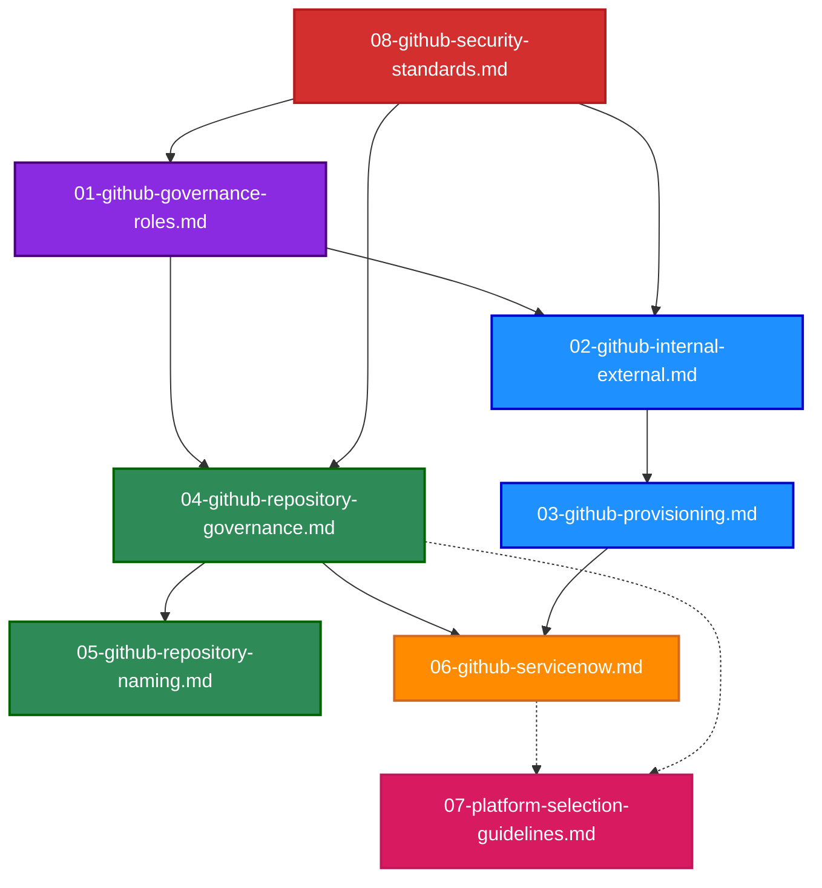
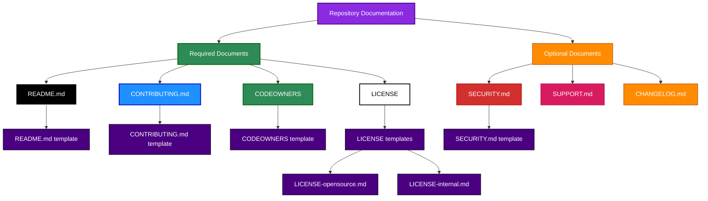
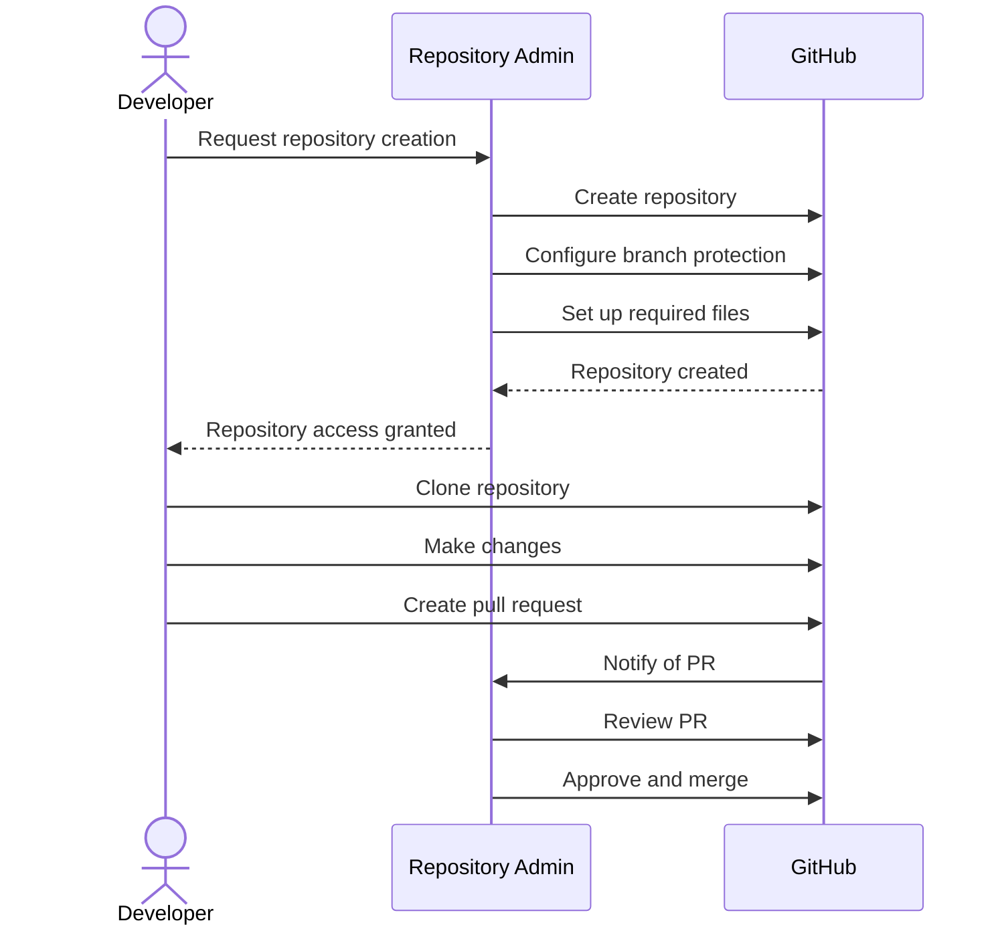

# Mermaid Examples

This document provides examples of well-formatted Mermaid diagrams for Norwegian Red Cross GitHub documentation.

## Governance Document Relationships

**Figure 1: Relationships between governance documents**

## Documentation Structure Example

**Figure 2: Repository documentation structure example**

## Sequence Diagram Example

**Figure 3: Repository creation sequence diagram example**
