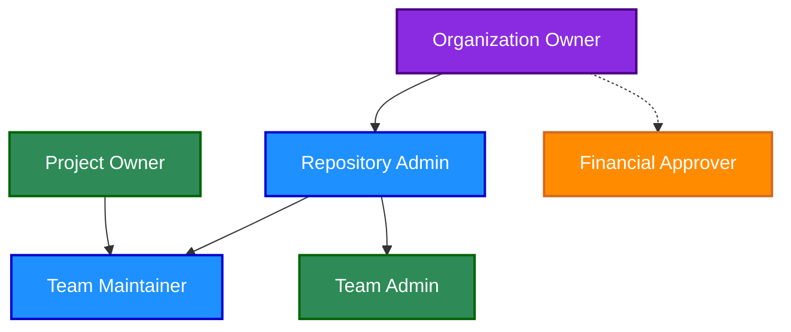

# GitHub Governance Roles

This document defines all roles involved in the governance of GitHub within Norwegian Red Cross. These roles span across repository management, team administration, and the request/approval process.

## Overview of Roles

The following diagram illustrates the relationship between key roles in our GitHub governance structure:

## Organization-Level Roles

### Organization Owner
- **Definition**: Individual with highest level of permissions, responsible for the overall GitHub organization.
- **Responsibilities**:
  - Managing billing and enterprise settings
  - Adding/removing Repository Admins
  - Configuring organizational security settings
  - Setting up organizational policies
- **Number of Users**: Limited group (2-3 people)
- **GitHub Permission Level**: Owner at organization level

### Repository Admin
- **Definition**: Trusted individual responsible for repository governance across the organization.
- **Responsibilities**:
  - Creating new repositories following organizational naming conventions
  - Setting up branch protection rules and security settings
  - Configuring initial permissions and access controls
  - Establishing CI/CD workflows and quality gates
  - Ensuring all repositories have required documentation
  - Managing repository lifecycle (archiving, deletion)
- **Number of Users**: 5-7 trusted members with strong Git/GitHub knowledge
- **GitHub Permission Level**: Admin on repositories

### Team Admin
- **Definition**: Individual responsible for managing GitHub team structures and memberships.
- **Responsibilities**:
  - Creating and configuring teams
  - Adding users to appropriate teams based on requests
  - Ensuring correct team hierarchies
  - Provisioning GitHub access for new users
  - Managing Outside Collaborator relationships
- **Number of Users**: Small group (3-5 people)
- **GitHub Permission Level**: Admin for team management

## Repository and Team-Level Roles

### Project Owner
- **Definition**: Person who owns and is responsible for a repository or project.
- **Responsibilities**:
  - Approving repository creation requests
  - Defining repository purpose and access requirements
  - Validating team composition for repositories
  - Ensuring repository follows organizational standards
  - Approving repository access requests
- **Number of Users**: Multiple (one per project)
- **GitHub Permission Level**: Usually Maintain on their repositories

### Team Maintainer
- **Definition**: Person who can manage a team's membership and settings.
- **Responsibilities**:
  - Adding/removing team members
  - Creating team discussions
  - Managing day-to-day team activities
  - Updating team descriptions and visibility
- **Number of Users**: Multiple (one or more per team)
- **GitHub Permission Level**: Team Maintainer + Write or Maintain on specific repositories

### Team Member
- **Definition**: Regular contributor to a repository or project.
- **Responsibilities**:
  - Contributing code to repositories
  - Participating in team discussions
  - Reviewing pull requests
  - Following contribution guidelines
- **Number of Users**: Many
- **GitHub Permission Level**: Usually Write permission

## External Contributor Roles

### Outside Collaborator
- **Definition**: External user (non-redcross.no) who contributes to specific repositories.
- **Responsibilities**:
  - Contributing to specific repositories only
  - Following contribution guidelines
  - Participating in project discussions
- **Number of Users**: Varies by project
- **GitHub Permission Level**: Repository-specific (usually Write)

## Approval and Governance Roles

### Financial Approver (Cost Center Manager)
- **Definition**: Manager responsible for approving the financial aspects of GitHub licenses.
- **Responsibilities**:
  - Approving costs for GitHub Enterprise licenses ($15 per user for SSO)
  - Budget management for GitHub expenses
  - Authorizing user access from a cost perspective
- **Number of Users**: Multiple (one per department/division)
- **GitHub Permission Level**: N/A (ServiceNow role)

## User Types

### Internal User
- **Definition**: Employee or consultant with a redcross.no account.
- **Characteristics**:
  - Has redcross.no email
  - Authenticates through SSO with Okta
  - Automatically assigned to organizational structure teams
  - Full member of the GitHub organization
- **GitHub Permission Level**: Varies based on team membership

### External User
- **Definition**: Pro-bono contributor, volunteer, or partner without a redcross.no account.
- **Characteristics**:
  - Uses personal GitHub account
  - Does not authenticate through SSO
  - Added as Outside Collaborator to specific repositories
  - Not a member of the GitHub organization
- **GitHub Permission Level**: Repository-specific permissions

## GitHub's Official Permission Levels

For reference, GitHub defines the following permission levels:

| GitHub Role | Description | Typical Use |
|-------------|-------------|-------------|
| Read | Can read and clone the repository | For team members who only need to view code |
| Triage | Read + can manage issues and PRs | For team members who help manage projects but don't write code |
| Write | Triage + can push to non-protected branches | For developers actively working on the code |
| Maintain | Write + can manage repository settings (except dangerous ones) | For project managers and tech leads |
| Admin | Full control including deletion and team access | For Repository Admins |

## Role Assignment Matrix

The following matrix shows which roles can assign other roles:

| Role | Can Assign |
|------|------------|
| Organization Owner | Repository Admin, Team Admin, Financial Approver |
| Repository Admin | Project Owner, Team Maintainer |
| Team Admin | Team Member, Outside Collaborator |
| Project Owner | Team Maintainer (for their projects) |
| Team Maintainer | Team Member (for their teams) |

## ServiceNow Request Process Roles

### Repository Requester
- **Definition**: Person who initiates a repository creation request.
- **Responsibilities**:
  - Completing the repository request form in ServiceNow
  - Providing required details about repository purpose and team
  - Following up on request status

### GitHub Access Requester
- **Definition**: Person who initiates a GitHub access request.
- **Responsibilities**:
  - Completing the GitHub access request form in ServiceNow
  - Providing justification for GitHub access
  - Following up on request status