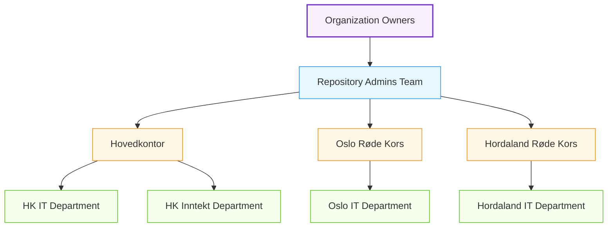
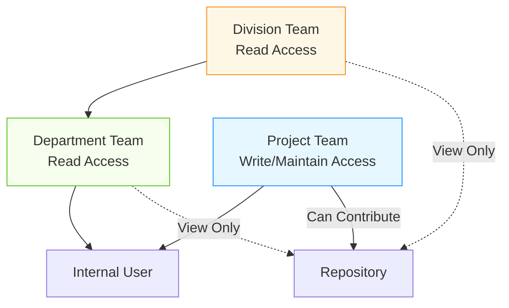
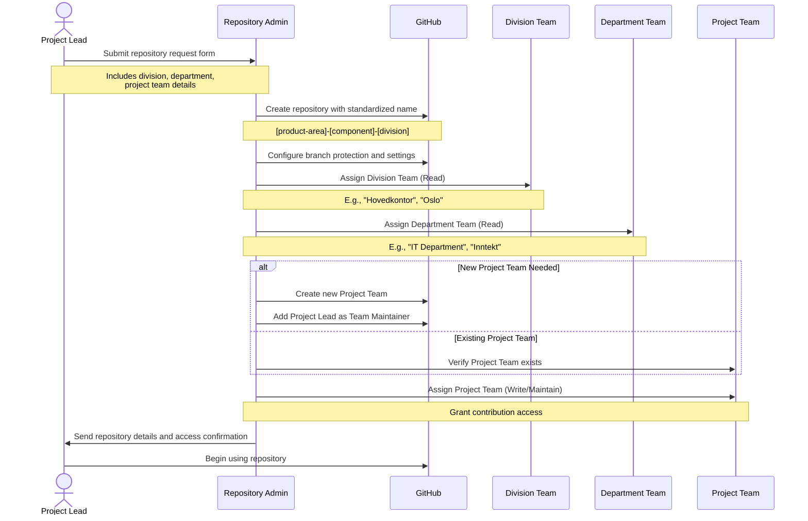
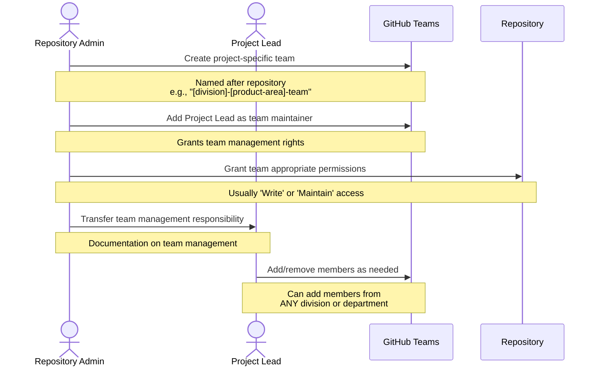

# Repository Governance in GitHub

## Repository Administration Structure

GitHub's permission model allows us to create a governance structure to maintain consistency, security, and proper governance across all repositories. This document outlines how we'll use GitHub's built-in roles to implement repository governance.

## Organization Owners and Repository Admins

Organization Owners have the highest level of permissions, while a dedicated team of Repository Admins will handle day-to-day repository governance:

**Figure 1: Repository Administration Structure with 2-Level Organizational Hierarchy**

### Organization Owners
- Limited group (2-3 people) with full administrative access to the organization
- Can change organization settings, billing, and security policies
- Ultimate oversight of all repositories and teams

### Repository Admins Team
- A team with Admin permission level across repositories
- Members from different divisions of the organization
- Responsible for repository creation and governance
- 5-7 trusted members with strong Git/GitHub knowledge

## Repository Access Based on Organizational Structure

With our 2-level organizational structure, Repository Admins will implement the following access model:

**Figure 2: Repository Access Model with 2-Level Organizational Structure**

### Access Assignment Strategy

1. **Division-Level Access (Level 1)**
   - Provides organization-wide visibility to division members
   - All members of a division get Read access to relevant repositories
   - Examples: "Hovedkontor", "Oslo Røde Kors", "Hordaland Røde Kors"

2. **Department-Level Access (Level 2)**
   - Provides more targeted visibility to department members
   - All members of a department get Read access to department-specific repositories
   - Examples: "IT Department", "Inntekt Department" within each division

3. **Project Team Access (Cross-Organizational)**
   - Provides contribution access (Write/Maintain) to actual contributors
   - Members can come from any division or department
   - Created specifically for repository contribution needs

## Repository Creation and Team Assignment Flow

The following diagram illustrates how Repository Admins will create repositories and assign teams based on the 2-level organizational structure:

**Figure 3: Repository Creation and Team Assignment Flow**

## Project Team Creation and Management

For project teams that need Write/Maintain access, Repository Admins will follow this process:

### Project Team Setup Process

**Figure 4: Project Team Setup and Delegation**

## Team Permission Matrix for 2-Level Structure

| Team Type | Level | Permission Level | Purpose |
|-----------|-------|------------------|---------|
| Division Team | Level 1 | Read | Visibility across division |
| Department Team | Level 2 | Read | Department-specific visibility |
| Project Team | Cross-Organizational | Write/Maintain | Repository contribution |
| Repository Admins | Organization-wide | Admin | Repository governance |

### Cross-Divisional Collaboration

The 2-level structure with Project Teams allows for efficient cross-divisional collaboration:

1. **Members from different divisions** can be added to the same Project Team
2. **IT departments from different divisions** can collaborate on shared repositories
3. **External collaborators** can be added to Project Teams (not Division/Department teams)

## Best Practices for Repository Team Assignment

1. **Appropriate Visibility**:
   - Always assign the relevant Division and Department teams (Read)
   - For division-specific repositories, assign only the relevant Division team
   - For department-specific repositories, assign both Division and Department teams

2. **Contribution Access**:
   - Always use Project Teams for Write/Maintain access
   - Never grant Write/Maintain directly to Division or Department teams
   - Keep Project Teams focused on active contributors only

3. **Naming Convention for Project Teams**:
   - Use format: "[division]-[product-area]-team"
   - For cross-divisional teams: "cross-[product-area]-team"
   
4. **Regular Access Reviews**:
   - Review Project Team membership quarterly
   - Audit Division and Department team assignments semi-annually
   - Verify that all repositories follow the correct access pattern