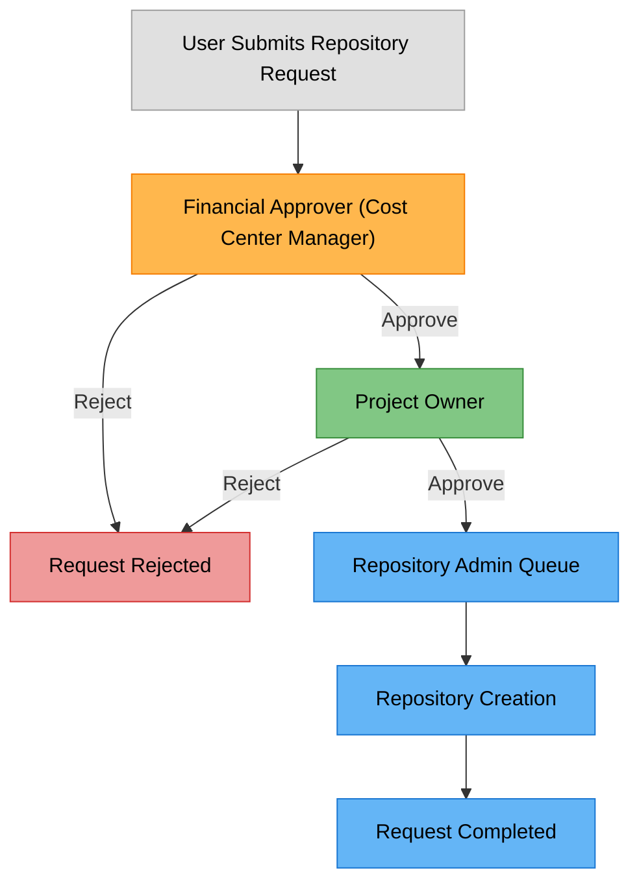

# GitHub ServiceNow Integration

## Overview

Norwegian Red Cross uses ServiceNow as the self-service portal for GitHub-related requests. This document outlines the two primary ordering flows:

1. **GitHub Repository Request Flow**: How users request new GitHub repositories
2. **GitHub Access Request Flow**: How users request access to GitHub

These ServiceNow-based flows ensure proper governance, standardization, and tracking of all GitHub-related requests.

## ServiceNow as the Single Point of Entry

All GitHub repository and access requests must go through ServiceNow to ensure:

- Proper approval workflows
- Standardized information collection
- Complete audit trails
- Integration with existing IT service management processes

**Figure 1: ServiceNow as Single Point of Entry for GitHub Requests**

## GitHub Repository Request Flow

The repository request flow begins in ServiceNow and feeds into the existing "Repository Creation and Team Assignment Flow" described in the github-repository-governance.md document.

### Repository Request Form Fields

The ServiceNow Repository Request form includes the following fields:

| Field | Description | Example |
|-------|-------------|---------|
| Division | Organizational division (dropdown from HR system) | Oslo Røde Kors |
| Department | Department (dropdown from HR system) | IT Department |
| Repository Name | Following [product-area]-[component]-[division] format | volunteer-portal-api-oslo |
| Purpose | Brief description of repository purpose | API for volunteer management application |
| Project Team | New team name or existing team (dropdown of existing teams + option to create new) | Oslo-Volunteer-Portal-Team |
| Internal Project Team Members | Internal team members selected from employee directory | [Selected employees from dropdown] |
| External Project Team Members | External collaborators (email addresses) | volunteer@example.com, partner@example.org |
| Special Requirements | Any special configuration needs | Requires specific CI/CD setup |
| Requested For | Person who will own the repository | [Selected from employee directory] |

The naming convention for repositories follows the standard defined in github-repository-naming.md, using the [product-area]-[component]-[division] format. The form provides guidance and examples to help users understand this naming pattern.

The Project Team field allows users to either select an existing team from a dropdown or create a new one by entering a name. New team names should follow the format defined in the github-repository-governance.md document: "[division]-[product-area]-team".

Division and Department dropdowns are synchronized with the HR system to ensure consistency across all systems. Internal Project Team Members allows selection directly from the ServiceNow employee directory, while External Project Team Members requires email addresses for outside collaborators. If any selected internal team members do not yet have GitHub access, the system will automatically generate the necessary GitHub access requests as part of the repository creation process.

### Repository Request Process

**Figure 2: GitHub Repository Request Flow via ServiceNow**

### Repository Request Approval Workflow

The repository request approval process involves multiple stakeholders with different concerns:

**Figure 3: Repository Request Approval Workflow**

1. **Financial Approver (Cost Center Manager)**:
   - Responsible for the financial aspect of GitHub licenses
   - Approves the cost implications ($15 per user for SSO access)
   - Usually the department or division manager responsible for the budget

2. **Project Owner**:
   - Responsible for the technical and access governance aspects
   - Validates the repository purpose and team composition
   - Verifies that the repository name follows conventions
   - Person who will own and be responsible for the repository

Only after both approvals are received does the request move to the Repository Admin queue for implementation.

## GitHub Access Request Flow

The access request flow manages how users request access to GitHub.

### Access Request Form Fields

The ServiceNow GitHub Access Request form includes the following fields:

| Field | Description | Example |
|-------|-------------|---------|
| User | Person requiring GitHub access (selected from employee directory) | [Selected employee from dropdown] |
| User Type | Internal or external user (dropdown) | Internal |
| Division | User's division (auto-populated from HR system) | Oslo Røde Kors |
| Department | User's department (auto-populated from HR system) | IT Department |
| Justification | Business reason for GitHub access | Working on development projects |
| Duration | Temporary or permanent access (dropdown) | Permanent |
| Requested For | Person who will receive access (auto-populated from User field) | [Same as User field] |
| Manager | User's manager (automatically populated from HR system) | [Auto-populated from HR data] |

For external users, additional fields appear:
| Field | Description | Example |
|-------|-------------|---------|
| External Email | Email address for external user | volunteer@example.com |
| Organization | Organization the external user belongs to | Partner Organization Name |
| Project | Project the external user will work on | Volunteer Portal |

### Access Request Process

**Figure 4: GitHub Access Request Flow via ServiceNow**

### Access Request Approval Workflow

The GitHub access request approval process involves multiple stakeholders with different concerns:

**Figure 5: GitHub Access Request Approval Workflow**

1. **Financial Approver (Cost Center Manager)**:
   - Responsible for the financial aspect of GitHub licenses
   - Approves the cost implications ($15 per user for SSO access)
   - Usually the department or division manager responsible for the budget

2. **Project Owner**:
   - Responsible for evaluating if the user needs GitHub access
   - Validates the justification for access
   - Ensures access is appropriate for the user's role
   - Person who will be responsible for the user's activities in GitHub

Only after both approvals are received does the request move to the Team Admin queue for implementation.