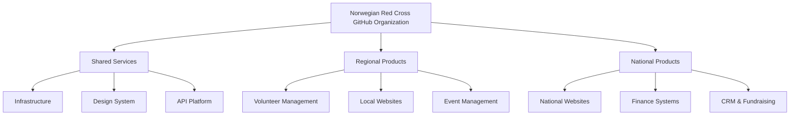
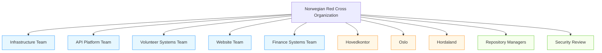

# Revised GitHub Structure for Norwegian Red Cross

## Aligning with GitHub Best Practices

Based on industry best practices for GitHub in large organizations, we're revising our approach to focus more on product ownership and collaboration while still maintaining logical separation between divisions.

## Organization Structure

We will maintain a single GitHub organization for Norwegian Red Cross with these structural elements:



**Figure 1:** Product-Based Organization Structure

## Repository Naming Conventions

Repositories will follow a product/service-focused naming convention while still indicating divisional ownership:

```
[product-area]-[component]-[division]
```

### Examples:

#### Shared Services:
- `infrastructure-monitoring`
- `design-system-components`
- `api-platform-core`

#### Regional Products with Division Indicators:
- `volunteer-portal-oslo`
- `website-frontend-hordaland`
- `event-management-oslo`

#### National Products:
- `crm-donor-management`
- `finance-reporting`
- `national-website-frontend`

This approach maintains divisional context where needed while emphasizing the product or service function first.

## Team Structure

The team structure will focus on product responsibilities while using nested teams to manage access for organizational units:



**Figure 2:** Product-Focused Team Structure

### Key Teams and Roles

1. **Product Teams**
   - Purpose: Teams organized around specific products or services
   - Members: Cross-functional team members with expertise in that product/service
   - Permissions: Primary maintainers of related repositories
   - Example: "API Platform Team" manages all API-related repositories

2. **Division Teams**
   - Purpose: Teams representing organizational divisions (Hovedkontor, Oslo, etc.)
   - Members: All users who belong to that division
   - Permissions: Read access to repositories relevant to their division
   - Example: "Oslo" team includes all Oslo Red Cross staff

3. **Access Management Teams**
   - Purpose: Teams with special access management responsibilities
   - Members: Trusted administrators and security personnel
   - Permissions: Repository creation, security review, etc.
   - Example: "Repository Managers" team has repository creation permissions

4. **Project Teams**
   - Purpose: Temporary teams formed for specific projects
   - Members: Contributors from various divisions working on a specific initiative
   - Permissions: Write access to project-specific repositories
   - Example: "Website Redesign Team" for a time-limited project

## Permission Model

The permission model will now balance product ownership with divisional context:

### Permission Levels Matrix

| Team Type | Repository Type | Permission Level | Purpose |
|-----------|----------------|------------------|---------|
| Product Teams | Related product repos | Admin/Write | Primary maintainers |
| Division Teams | Division-specific repos | Read | Division-wide visibility |
| Repository Managers | All repos | Admin (creation only) | Governance and standards |
| Project Teams | Project-specific repos | Write | Temporary collaboration |

### Cross-Functional Collaboration

To foster innersourcing and collaboration:

1. **Default Visibility**
   - Most repositories should be visible to all organization members
   - Encourage cross-team contributions through pull requests

2. **Contribution Process**
   - Anyone can propose changes via fork and pull request model
   - Product teams review and approve contributions

3. **Shared Resources**
   - Common components should be in dedicated repositories
   - Encourage reuse across division boundaries

## Implementation Plan

To transition to this product-focused structure while maintaining divisional context:

1. **Create Product Teams**
   - Identify key product areas and services
   - Create corresponding teams with clear ownership

2. **Map Current Teams**
   - Map existing staff to both product and division teams
   - Many staff will belong to multiple teams

3. **Adjust Repository Structure**
   - Begin with new repositories following product-first naming
   - Gradually migrate existing repositories as appropriate

4. **Documentation**
   - Create clear documentation explaining the product-focused model
   - Provide guidelines for cross-team collaboration

## Best Practices Alignment

This revised approach better aligns with GitHub best practices by:

- Focusing on product ownership rather than organizational structure
- Enabling cross-divisional collaboration and innersourcing
- Maintaining divisional context where needed
- Simplifying permission management
- Encouraging code reuse and shared responsibility