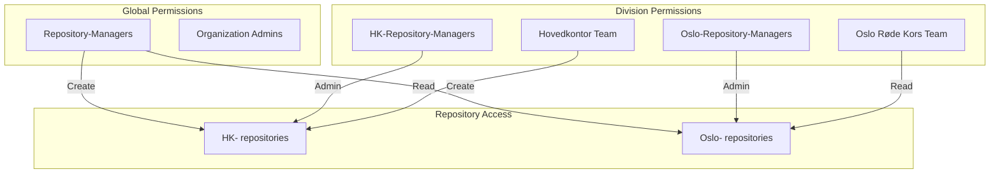
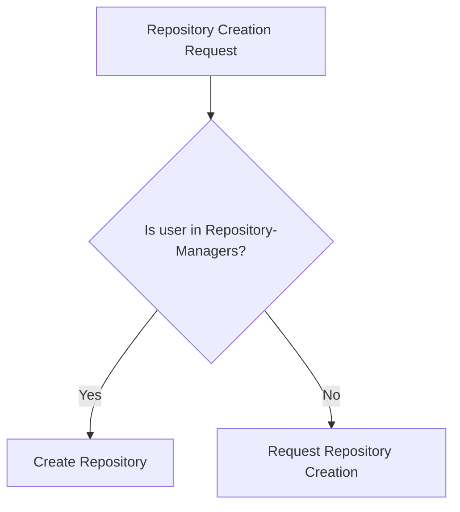
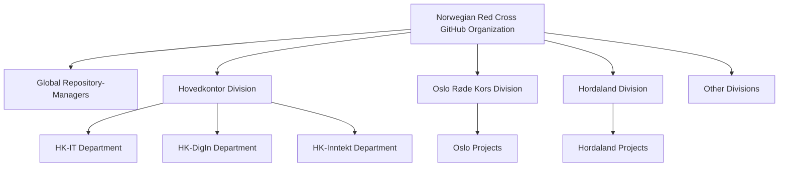
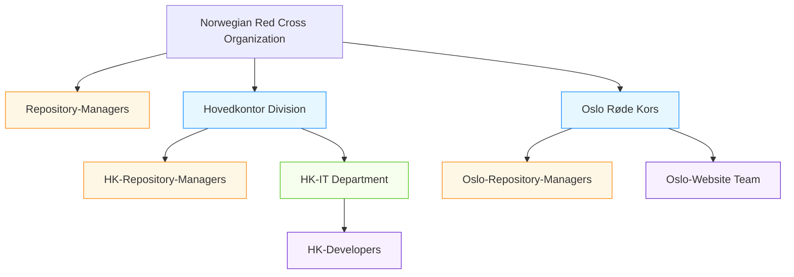
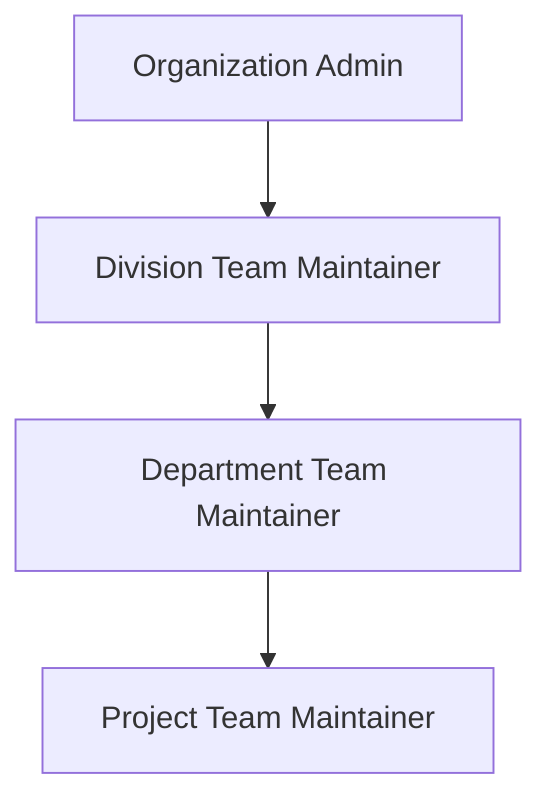

### Permission Model Overview



**Figure 5:** Permission Model Overview Showing Repository-Managers as a Global Role### Repository Creation Process



**Figure 4:** Repository Creation Process# GitHub Organization Structure for Norwegian Red Cross

## Table of Contents

1. [Organization Structure](#organization-structure)
2. [Repository Naming Conventions](#repository-naming-conventions)
3. [Team Structure](#team-structure)
4. [Permission Model](#permission-model)

## Organization Structure

The Norwegian Red Cross will use a single GitHub organization with logical separation between divisions and departments using a combination of:

- Hierarchical team structure with a global Repository-Managers team
- Consistent repository naming conventions 
- Team-based access control
- GitHub topics for additional organization



**Figure 1:** Overall Organization Structure

## Repository Naming Conventions

Repositories will follow a consistent naming structure to indicate ownership and purpose:

```
[division]-[department]-[repo-purpose]
```

### Examples:

#### Hovedkontor Repositories:
- `hk-it-infrastructure`
- `hk-it-user-management`
- `hk-digin-analytics`
- `hk-digin-data-warehouse`
- `hk-inntekt-donation-portal`
- `hk-inntekt-campaign-manager`

#### Division Repositories:
- `oslo-volunteer-management`
- `oslo-events-calendar`
- `oslo-website`
- `hordaland-training-system`
- `hordaland-volunteer-portal`

### When to Use Department-Level Prefixes

Include department prefixes when:
- Departments have significant autonomy in their codebase
- Multiple departments create repositories frequently
- Repositories might have similar names across departments
- Department-specific governance applies

### When to Skip Department-Level Prefixes

Skip the department prefix when:
- Repositories are used across multiple departments within the same division
- The number of repositories is small
- Department names change frequently (organizational instability)

## Team Structure

In GitHub, a team is a group of users with defined permissions to repositories within the organization. Teams are the primary way to manage access to repositories and provide a way to communicate with groups of people.

### Understanding GitHub Teams

A GitHub team:

1. **Is a collection of GitHub users** - Team members can be employees (authenticating through SSO) or outside collaborators
   
2. **Has defined permissions** - Teams can be granted specific levels of access (read, write, admin) to repositories
   
3. **Can be nested hierarchically** - Teams can contain other teams, creating a permission inheritance structure
   
4. **Has maintainers** - Team maintainers can add/remove members and manage team settings without needing organization admin rights
   
5. **Enables @mentions** - Teams can be mentioned in issues, pull requests, and discussions with @team-name

### Team Structure for Norwegian Red Cross

The team structure mirrors the organizational structure, with nested teams providing a hierarchical permission model:



**Figure 2:** Simplified Team Structure with Color Coding

### Key Teams and Roles

1. **Repository-Managers**
   - Purpose: Organization-wide team with global repository creation permissions
   - Members: Limited to trusted administrators who understand organizational standards
   - Permissions: Can create repositories across the entire organization
   - Responsibility: Enforce naming conventions and repository standards
   - **Important**: This team exists outside the division hierarchy with global permissions

2. **Division Teams** (Hovedkontor, Oslo, Hordaland)
   - Purpose: Parent teams representing major organizational divisions
   - Members: All users who belong to that division
   - Permissions: Base level read access to all repositories within their division
   - Example: "Hovedkontor" team includes all headquarters staff

3. **Division Repository Managers**
   - Purpose: Teams that manage repositories for a specific division
   - Members: Trusted individuals within that division
   - Permissions: Admin rights to repositories within their division only
   - Example: "HK-Repository-Managers" team has admin access to all `hk-*` repositories

4. **Department Teams**
   - Purpose: Teams representing specific departments within divisions
   - Members: Staff belonging to that department
   - Permissions: Write access to repositories related to their department
   - Example: "HK-IT" team has write access to all `hk-it-*` repositories

5. **Project Teams**
   - Purpose: Repository-specific teams focused on individual projects
   - Members: Internal and external contributors working on the specific project
   - Permissions: Write or admin access to specific repositories only
   - Example: "hk-it-infrastructure-team" for the `hk-it-infrastructure` repository

## Permission Model

The permission model follows the principle of least privilege while enabling effective collaboration:

### Permission Levels in GitHub

GitHub offers several permission levels that can be assigned to teams or individual collaborators:

1. **Read**: Can view and clone the repository, open issues, and submit pull requests
2. **Triage**: Everything in Read plus managing issues and pull requests
3. **Write**: Everything in Triage plus pushing to the repository
4. **Maintain**: Everything in Write plus managing repository settings (except dangerous operations)
5. **Admin**: Full access including deletion and adding collaborators

### Repository Creation Permissions

Repository creation is limited to maintain quality and standards:

- Only members of the **Repository-Managers** team can create new repositories
- Repository creation follows documented organization standards for:
  - Naming conventions
  - Required files (README, LICENSE, CONTRIBUTING)
  - Branch protection rules
  - Security settings

### Team Hierarchy and Permissions

### Team Hierarchy and Maintainer Roles



**Figure 3:** Team Maintainer Hierarchy

### Repository-Specific Teams

For each significant repository, a dedicated project team can be created:
- Named according to the repository (e.g., `hk-it-infrastructure-team`)
- Granted appropriate permissions to the repository
- Maintainers can add both internal and external contributors

### Access Control Matrix

| Team | Repository Type | Access Level |
|------|----------------|--------------|
| Hovedkontor | hk-* | Read |
| Oslo Røde Kors | oslo-* | Read |
| Hordaland Røde Kors | hordaland-* | Read |
| HK-Repository-Managers | hk-* | Admin |
| Oslo-Repository-Managers | oslo-* | Admin |
| Hordaland-Repository-Managers | hordaland-* | Admin |
| HK-IT | hk-it-* | Write |
| HK-DigIn | hk-digin-* | Write |
| HK-Inntekt | hk-inntekt-* | Write |
| Project Teams | Specific repository | Write/Admin |

### Example Project Team Workflow

1. Repository Manager creates a new repository `hk-it-infrastructure`
2. Creates a team called `hk-it-infrastructure-team`
3. Grants the team admin or write access to the repository
4. Assigns appropriate team maintainers
5. Team maintainers add developers (internal or external) to the team