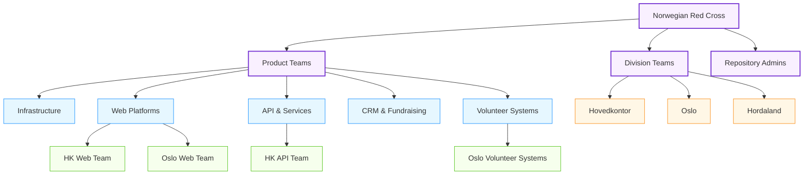
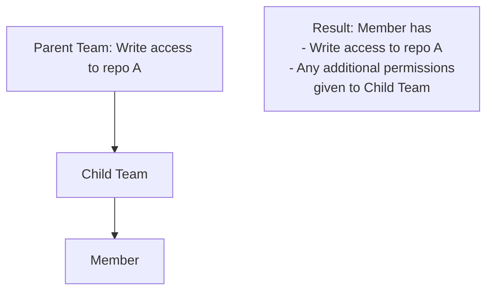
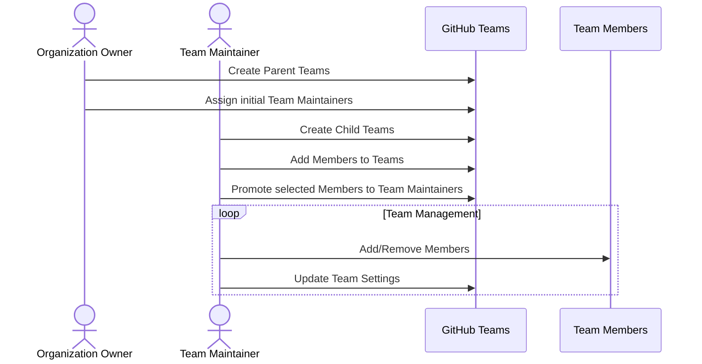

# GitHub Team Structure

## Overview

GitHub Teams provide a powerful way to manage access and organize members within our organization. This document outlines our hierarchical team structure that balances product-focused and division-focused organization while following GitHub best practices.

## Hierarchical Team Structure

We implement a nested team structure to take advantage of GitHub's permission inheritance and organizational capabilities. This approach allows members to belong to both product-focused and division-based teams.



**Figure 1: Hierarchical Team Structure**

## Team Categories

Our team structure consists of four main categories:

### 1. Organization-Level Teams

These top-level teams provide the main organizational structure:

- **Product Teams**: Parent team for all product-focused teams
- **Division Teams**: Parent team for all division-based teams
- **Repository Admins**: Team with administrative rights to manage repositories

### 2. Product-Based Teams

Teams organized around product areas and technology domains:

- **Infrastructure**: Core infrastructure and platform services
- **Web Platforms**: Web-based applications and sites
- **API & Services**: Backend services and APIs
- **CRM & Fundraising**: Customer relationship management systems
- **Volunteer Systems**: Volunteer management applications

### 3. Division-Based Teams

Teams organized around organizational divisions:

- **Hovedkontor**: Headquarters
- **Oslo**: Oslo Red Cross
- **Hordaland**: Hordaland Red Cross
- Additional division teams as needed

### 4. Project Teams

Specific teams at the intersection of products and divisions:

- **HK Web Team**: Web development for Headquarters
- **Oslo Volunteer Systems**: Volunteer systems for Oslo
- **Hordaland Event Management**: Event systems for Hordaland

## Permission Inheritance

GitHub Teams use hierarchical permission inheritance, which means:

1. Child teams inherit access permissions from parent teams
2. Members of child teams are automatically members of parent teams
3. Additional permissions can be granted to child teams beyond what they inherit



**Figure 2: Permission Inheritance Model**

## Team Creation and Membership Workflow

### Creating a New Team

1. **Determine placement in hierarchy**:
   - Is it a product-focused team? Place under Product Teams
   - Is it a division-focused team? Place under Division Teams
   - Is it a specific project team? Place under both appropriate parent teams

2. **Create the team**:
   - Only Repository Admins or Organization Owners should create parent teams
   - Project Leads (Team Maintainers) can create child teams under their area

3. **Set team visibility**:
   - Visible: Standard for most teams
   - Secret: For teams managing sensitive repositories

### Managing Team Membership

Each team has designated Team Maintainers who can:
- Add or remove team members
- Promote team members to Team Maintainer role
- Create child teams
- Manage team settings



**Figure 3: Team Management Workflow**

## Repository Access by Team

Teams are granted different levels of access to repositories based on their role:

| Team Type | Typical Permission Level | Access Scope |
|-----------|--------------------------|--------------|
| Product Teams | Read or Write | Repositories related to the product area |
| Division Teams | Read | Repositories related to the division |
| Project Teams | Write or Maintain | Specific repositories for the project |
| Repository Admins | Admin | All repositories |

## Cross-Functional Teams

For initiatives that span multiple products or divisions:

1. Create a dedicated team for the initiative
2. Place it under the appropriate parent teams
3. Grant specific access to relevant repositories

Example:
```
Norwegian Red Cross
  └── Cross-Functional Teams
       └── Digital Transformation Initiative
```

## Best Practices for Team Structure

1. **Limit Nesting Depth**: Avoid more than 3 levels of team nesting for clarity

2. **Balance Team Size**: 
   - Parent teams can be large
   - Child teams should typically have 3-12 members for effective collaboration

3. **Use Descriptive Names**:
   - Follow the naming pattern: `[Division]-[Product/Project]`
   - Example: `Oslo-Web-Team`, `HK-Infrastructure`

4. **Regularly Audit Teams**:
   - Review team membership quarterly
   - Archive teams for completed projects
   - Ensure permissions are appropriate

5. **Document Team Purpose**:
   - Use team description field to explain the team's purpose
   - Include links to relevant resources
   - List team responsibilities

## Team Structure Updates

The team structure should evolve with the organization:

1. New divisions can be added as top-level division teams
2. New product areas can be added under Product Teams
3. Project teams can be created and archived as needed

Changes to the top-level structure should be approved by Organization Owners, while Team Maintainers can manage their respective sub-teams.